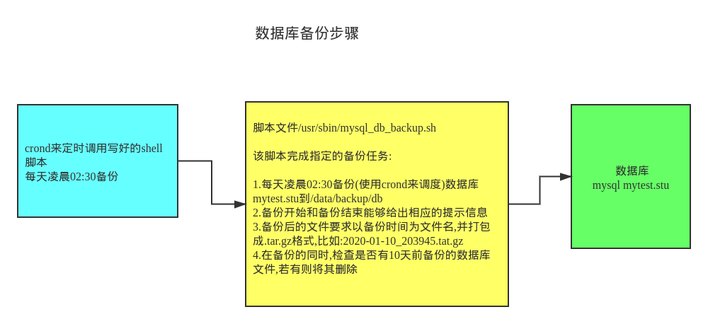
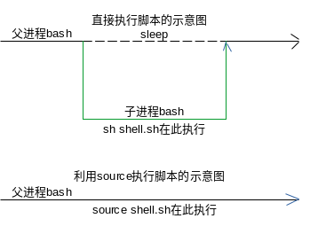

[toc]

# Bash Shell 编程

## 1. shell简介

shell是一个命令行解释器，它为用户提供了一个向Linux内核发送请求以便运行程序的界面系统级程序，用户可以用shell来启动、挂起、停止甚至编写一些程序

所以，shell是用户使用Linux的桥梁。shell既是一种命令语言，又是一种程序设计语言

 

 

学习shell编程的目的：

- Linux运维工程师在进行服务器集群管理时，需要编写shell程序来进行服务器管理
- 对于JavaEE和Python程序员来说，工作的需要。经常需要编写一些shell脚本进行程序或服务器的维护，比如编写一个定时备份数据库的脚本
- 对于大数据程序员，需要编写shell程序来管理集群

shell脚本，是一种为shell编写的脚本程序

我们所说的shell通常都是指shell脚本，但是shell和shell script是两个不同的概念

通常说shell编程，都是指shell脚本编程，而不是指开发shell本身

## 2. shell环境

shell编程与JavaScript、php编程一样，只要有一个能编写代码的文本编辑器和一个能解释执行的脚本解释器就可以了

Linux的shell种类很多，常见的有

- Bourne Shell(/usr/bin/sh或/bin/sh)
- Bourne Again Shell(/bin/bash)
- C Shell(/usr/bin/csh)
- K Shell(/usr/bin/ksh)
- Shell for Root(/sbin/sh)

本文所用到的shell环境为Bash(Bourne Again Shell)，由于易用和免费，Bash在日常工作中被广泛使用；同时，Bash也是大多数Linux系统默认的Shell

在一般情况下，并不区分Bourne Shell和Bourne Again Shell,所以，像 **#!/bin/sh** 同样可以改为 **#!/bin/bash** 

**#!** 告诉系统其后路径所指定的程序即是解释此脚本文件的Shell程序

## 3. shell脚本的执行方式

### 3.1 脚本格式要求

- 脚本以 **#!/bin/bash** 开头
- 脚本需要有可执行权限
- 约定俗成，一般shell脚本文件都是以 **.sh** 作为扩展名

```bash
❯ # 创建一个shell脚本文件hello.sh
❯ nv hello.sh

#!/bin/bash
echo "Hello, World!"
```
注:

- **#!** 是一个约定的标记，它告诉系统这个脚本需要什么解释器来执行，即用那一种shell
- **echo** 命令用于向窗口输出文本

### 3.2 运行shell脚本的2种方式

- **方式1 - 作为可执行程序**

```bash
❯ # 给脚本文件hello.sh添加执行权限
❯ sudo chmod u+x hello.sh
[sudo] password for cxy: 

❯ ls -l hello.sh
-rwxr--r--. 1 cxy cxy 33 Dec 30 13:45 hello.sh

❯ # 执行脚本文件hello.sh
❯ ./hello.sh
Hello, World! # 输出的内容
```
注意：一定要写成 **./hello.sh**，而不是**hello.sh** 

运行其它二进制程序也一样，直接写hello.sh，Linux系统会去PATH里寻找有没有名为hello.sh的文件，而当前目录可能不在环境变量PATH里，所以写成hello.sh会找不到命令。故而，要用./hello.sh告诉系统，就在当前目录找。或者使用文件的绝对路径/home/cxy/hello.sh

- **方式2 - 作为解释器的参数来运行**

这种运行方式是，直接运行解释器，其参数就是shell脚本文件的文件名hello.sh

这时，不需要在第一行指定解释器信息，即不需要#!/bin/bash这一行内容了

也可以不需要执行权限

```bash
❯ # 作为解释器参数运行脚本文件hello.sh
❯ /bin/sh ./hello.sh
Hello, World!
```
## 4. shell变量

### 4.1 变量的类型

运行shell时，会同时存在3种变量

- **局部变量 - 自定义变量** 局部变量在脚本或命令中定义，仅在当前shell实例中有效，其它shell启动的程序不能访问局部变量
- **系统变量 - 环境变量** 所有的程序，包括shell启动的程序，都能访问环境变量，有些程序需要环境变量来保证其正常运行，必要的时候shell脚本也可以定义环境变量,下面的PATH、HOME都是环境变量
```bash
❯ echo ${PATH}
/usr/local/bin:/usr/bin
❯ echo ${HOME}
/home/cxy
```
		- 使用set命令可以显示所有的系统变量
- **shell变量** shell变量是由shell程序设置的特殊变量，shell变量中有一部分是环境变量，有一部分是局部变量，这些变量保证了shell的正常运行

### 4.2 变量的定义

***基本语法***

`variable=value 即 变量名=值`

**定义变量的基本规则** 

- 等号两边不能有空格
- 变量名只能使用英文字母、数字和下划线构成
- 不能以数字开头
- 不能使用标点符号
- 不能使用bash中的关键字(可使用help命令查看保留关键字)
- 约定俗成，一般变量名习惯使用大写

| 有效的变量名    | 无效的变量名     |
| ------          | ------           |
| RUNOOB          | ?var=123         |
| LD_LIBRARY_PATH | user*name=runoob |
| _var            | 12fox            |
| var2            | %ab              |

***使用语句给变量赋值*** 

除了显式的直接赋值，还可以用语句给变量赋值

```bash
for file in `ls /etc`
或
for file in $(ls /etc)
```

以上语句将/etc目录下的文件名循环出来

***只读(静态)变量 - read only*** 

使用readonly命令可以将变量定义为只读变量，只读变量的值不能被改变

```bash
#!/bin/bash
myUrl="https://www.google.com" # 定义变量myUrl
readonly myUrl # 将变量myUrl设置为只读
myUrl="https://www.runoob.com" # 试图改变变量myUrl的值 - 结果不成功
# 运行后会输出如下结果
❯ sh ./readonly_var.sh
./readonly_var.sh: line 16: myUrl: readonly variable

```

### 4.3 变量的使用

使用一个定义过的变量，只要在变量名前面加美元符号$即可

```bash
# 定义变量your_name
❯ your_name="jacky"
# 使用变量的方式1
❯ echo $your_name
jacky
# 使用变量的方式2
❯ echo ${your_name}
jacky

```
这里的\$your_name等价于\${your_name}

还可以这样使用变量

```bash
❯ A=100
❯ echo A=${A}
A=100
❯ echo A=$A
A=100
❯ echo "A=${A}"
A=100
❯ echo "A=$A"
A=100

```
这里的A=会原样输出，在遇到美元符号$后，其后面的内容会被解释器识别为变量，输出其值为100

变量名外面的花括号是可选的，加上花括号是为了帮助解释器识别变量的界

```bash
❯ for skill in Ada Coffe Action Java; do
for> echo "I am good at ${skill}Script"
for> done             
I am good at AdaScript
I am good at CoffeScript
I am good at ActionScript
I am good at JavaScript

```
如果不给skill变量加上花括号，写成echo "I am good at \$skillScript", 解释器就会把\$skillScript当成一个变量(其值为空)，代码就不是期望的输出结果了

```bash
❯ for skill in Ada Coffe Action Java; do
for> echo "I am good at $skillScript"
for> done             
I am good at 
I am good at 
I am good at 
I am good at

```
***推荐在使用变量时给所有变量加上花括号，这是一个好的编程习惯*** 

已经定义的变量，可以被重新定义

```bash
❯ your_name="tom" # 定义变量your_name
❯ echo ${your_name}
tom
# 重新定义变量your_name,注意不能加上$符号，只有在使用变量时才需要加上美元符号$
❯ your_name="jerry" # 重新定义变量your_name
❯ echo ${your_name}
jerry

```
### 4.4 变量的删除 - unset

```bash
unset variable_name
```
变量被删除后不能再次使用

```bash
❯ myUrl="https://www.google.com" # 定义变量myUrl
❯ echo ${myUrl} # 显示变量
https://www.google.com
❯ unset myUrl # 删除变量
❯ echo ${myUrl} # 再次输出，结果为空

```
unset命令不能删除只读(静态)变量

```bash
❯ readonly mycat="tom" # 定义只读变量mycat
❯ unset mycat # 试图使用unset删除变量mycat - 结果不成功
zsh: read-only variable: mycat # 提示mycat是只读变量
```
### 4.5 将命令的返回结果赋给变量

```bash
variable=`command` # 使用反引号``
或
variabel=$(command) # 使用小括号()
```
```bash
❯ # 将date命令的结果赋给变量
❯ C=`date`
❯ D=$(date)
❯ echo "C=${C}"
C=Wed Dec 30 22:33:32 CST 2020
❯ echo "D=${D}"
D=Wed Dec 30 22:33:45 CST 2020
```
### 4.6 将变量设置为环境(全局/系统)变量

将变量设置为环境变量的目的:

- 可以实现在多个shell脚本中调用，从而避免了变量的重复定义
- 比如，a脚本文件中要使用变量TOMCAT_HOME，b脚本中也要使用变量TOMCAT_HOME
- 可以将TOMCAT_HOME设置成环境变量，这样就不需要分别在a脚本和b脚本中都定义TOMCAT_HOME变量了

***基本语法及步骤*** 

1. export variable=value # 将shell变量设置为环境变量
2. source configuration file(/etc/profile) # 让修改后的配置信息立即生效
3. echo ${variable} # 查询环境变量的值

***将/opt/tomcat设置为环境变量*** 

```bash
❯ # 编辑/etc/profile配置文件
❯ nv /etc/profile
# 打开这个文件,在最下面添加如下的语句
# 将Tomcat添加到环境变量
export TOMCAT_HOME=/opt/tomcat

# 保存退出

# 让修改后的配置信息立即生效
❯ source /etc/profile

# 查看是否成功设置成功
❯ echo ${TOMCAT_HOME}
/opt/tomcat
```
## 5. shell的注释方法

### 5.1 单行注释

在行首加上#

```bash
# This is single row comment
```
### 5.2 多行注释

```bash
:<<!
This is mulit-row comments
The quich brown fox jumps over a lazy dog
!
```
## 6. 位置参数变量

### 6.1 位置参数变量简介

当我们执行一个shell脚本时，如果希望获取到命令行的参数信息，就可以使用到位置参数变量。比如`./myshell.sh 100 200`，这个就是一个执行shell脚本的命令行，可以在myshell.sh脚本中获取到参数信息(即获取到位置参数100或200)

### 6.2 基本语法

| 语法   | 功能                   | 说明                     |
| ------ | ------                 | ------                   |
| ${0}   | 代表命令本身           | 即执行的脚本本身         |
| ${n}   | n为整数                | 表示第n个参数            |
| ${*}   | 命令行中所有的参数     | 所有的参数看成一个整体   |
| ${@}   | 命令行中所有的参数     | 每个参数区别对待         |
| ${#}   | 命令行中所有参数的个数 | 即命令行中共有多少个参数 |

\${*}与\${@}的区别

- 相同点:都是引用所有参数
- 不同点:只有在双引号中体现出来
    - 比如在脚本运行时写了3个参数1、2、3,则
    - ${*}等价于"1 2 3" - 即传递了一个参数
    - ${@}等价于"1" "2" "3" - 传递了三个参数

### 6.3 举例说明

```bash
# myshell.sh
#!/bin/bash
echo "参数0=${0}"
echo "参数1=${1}"
echo "参数2=${2}"
echo "所有的参数(\${*}的结果)=${*}"
echo "所有的参数(\${@}的结果)=${@}"
echo "参数的总数=${#}"

执行并输出结果:
❯ ./myshell.sh 100 200 abc
参数0=./myshell.sh
参数1=100
参数2=200
所有的参数(${*}的结果)=100 200 abc
所有的参数(${@}的结果)=100 200 abc
参数的总数=3
```
## 7. 预定义变量

### 7.1 简介

预定义变量就是shell设计者事先已经定义好的变量，可以直接在shell脚本中使用

### 7.2 基本语法

|语法 |功能 |说明 |
|------ |------ |------ |
|$$ |当前进程的进程号PID |获取当前进程的PID |
|$! |后台运行的最后一个进程的进程号PID |获取其PID |
|$? |最后一次执行的命令的返回状态,正确与否 |若这个变量的值为0,则说明上一个命令正确执行;若是非0(具体由命令自己决定是那个数),则上一个命令执行不正确 |

### 7.3 举例说明

```bash
# pre_var.sh
#!/bin/bash
echo "Present running process's ID is $$"
# 以后台的方式运行一个脚本，并获取它的进程号
/home/cxy/shcode/myshell.sh & # 这里的&符号表示在后台运行
echo "最后一个后台方式运行的进程的ID是:$!"
echo "执行的结果是:$?"

执行并输出结果
❯ ./pre_var.sh
Present running process's ID is 3716
最后一个后台方式运行的进程的ID是:3717
执行的结果是:0
参数0=/home/cxy/shcode/myshell.sh                                                                                                                   
参数1=
参数2=
所有的参数(${*}的结果)=
所有的参数(${@}的结果)=
参数的总数=0

```
## 8. shell运算符

shell和其它编程语言一样，支持多种运算符

- 算数运算符
- 关系运算符
- 布尔运算符
- 字符串运算符
- 文件测试运算符

原生bash不支持简单的数学运算，但是可以通过其它命令来实现，例如awk和expr，expr最常用

expr是一款表达式计算工具，使用它能完成表达式的求值操作

### 8.1 运算式的3种方式

- \$((运算式))
- \$[运算式]
- expr m + n
    - expr 的表达式与运算符之间要有空格，比如expr 2 + 3，不能写成expr 2+3
    - 若要将expr的结果赋给一个变量，完整的表达式要使用反引号``包含
    - expr的乘法运算符要使用转义字符\转义；比如要计算2乘以3就要写成:expr 2 \\* 3

两个实例来说明

```bash
# 案例1 计算(2+3)*4的值
# 使用第1种方式 - $((expression))
RES1=$(((2+3)*4))
echo "res1=${RES1}"
# 使用第2种方式 - $[expression]
RES2=$[(2+3)*4]
echo "res2=${RES2}"
# 使用第3种方式 - expr expression
# 要分成2步
TEMP=`expr 2 + 3`
RES3=`expr ${TEMP} \* 4`
echo "res3=${RES3}"
# 案例2 求出命令行的两个参数(整数)的和
SUM=$[${1}+${2}]
echo "Sum is ${SUM}"
```

### 8.2 算术运算符

下表列出了常用的算术运算符

假定变量a=10;变量b=20

|运算符 |说明 |写法1(\$((运算符))) |写法2(\$[运算符]) |写法3(expr m + n) |结果 |
|------ |------ |------ |------ |------ |------ |
|+ |加法 |\$((\${a}+\${b})) |\$[\${a}+\${b}] |\`expr \${a} + \${b}\` |30 |
|- |减法 |\$((\${a}-\${b})) |\$[\${a}-\${b}] |\`expr \${a} - \${b}` |-10 |
|* |乘法 |\$((\${a}*\${b})) |\$[\${a}*\${b}] |\`expr \${a} \\* \${b}` |200 |
|/ |除法 |\$((\${b}/\${a})) |\$[\${b}/\${a}] |\`expr \${b} / \${a}` |2 |
|% |取余 |\$((\${b}%\${a})) |\$[\${b}%\${a}] |\`expr \${b} % \${a}` |0 |
|= |赋值 |a=\${b} |把变量b的值赋给a | | |
|== |相等(比较两个数字) |[ \${a} == \${b} ] |相等,返回true |不等,返回false |false |
|!= |不相等(比较两个数字) |[ \${a} != \${b} ] |相等,返回false |不等,返回true |true |

**注意:条件表达式要放在方括号之间，并且要有空格** 

实例

```bash
# oper1.sh
#!/bin/bash

a=10
b=20

val=`expr ${a} + ${b}`
echo "a + b : ${val}"

val=`expr ${a} - ${b}`
echo "a - b : ${val}"

val=`expr ${a} \* ${b}`
echo "a * b : ${val}"

val=`expr ${b} / ${a}`
echo "b / a : ${val}"

val=`expr ${b} % ${a}`
echo "b % a : ${val}"

if [ ${a} == ${b} ]
then
    echo "a 等于 b"
fi
if [ ${a} != ${b} ]
then
    echo "a 不等于 b"
fi

运行结果
❯ ./oper1.sh
a + b : 30
a - b : -10
a * b : 200
b / a : 2
b % a : 0
a 不等于 b
```
### 8.3 关系运算符

关系运算符只支持数字，不支持字符串，除非字符串的值是数字

下表列出了常用的关系运算符

假定变量a=10；变量b=20

|运算符 |说明 |举例 |结果 |
|------ |------ |------ |------ |
|-eq |检测两个数是否相等,相等返回true |[ ${a} -eq ${b} ] |false |
|-ne |检测两个数是否不相等,不等返回true |[ ${a} -ne ${b} ] |true |
|-gt |检测左边的数是否大于右边的,若是,则返回true |[ ${a} -gt ${b} ] |false |
|-lt |检测左边的数是否小于右边的,若是,则返回true |[ ${a} -lt ${b} ] |true |
|-ge |检测左边的数是否大于等于右边的,若是,则返回true |[ ${a} -ge ${b} ] |false |
|-le |检测左边的数是否小于等于右边的,若是,则返回true |[ ${a} -le ${b} ] |true |

实例

```bash
# relation_oper.sh
#!/bin/bash

a=10
b=20

if [ ${a} -eq ${b} ]
then
    echo "${a} -eq ${b} : a 等于 b"
else
    echo "${a} -eq ${b} : a 不等于 b"
fi

if [ ${a} -ne ${b} ]
then
    echo "${a} -ne ${b} : a 不等于 b"
else
    echo "${a} -ne ${b} : a 等于 b"
fi

if [ ${a} -gt ${b} ]
then
    echo "${a} -gt ${b} : a 大于 b"
else
    echo "${a} -gt ${b} : a 不大于 b"
fi

if [ ${a} -lt ${b} ]
then
    echo "${a} -lt ${b} : a 小于 b"
else
    echo "${a} -lt ${b} : a 不小于 b"
fi

if [ ${a} -ge ${b} ]
then
    echo "${a} -ge ${b} : a 大于或等于 b"
else
    echo "${a} -ge ${b} : a 小于 b"
fi

if [ ${a} -le ${b} ]
then
    echo "${a} -le ${b} : a 小于或等于 b"
else
    echo "${a} -le ${b} : a 大于 b"
fi

执行并输出结果
❯ ./relation_oper.sh
10 -eq 20 : a 不等于 b
10 -ne 20 : a 不等于 b
10 -gt 20 : a 不大于 b
10 -lt 20 : a 小于 b
10 -ge 20 : a 小于 b
10 -le 20 : a 小于或等于 b
```
### 8.4 布尔运算符

常用的布尔运算符,假定变量a=10；变量b=20

| 运算符 | 说明                                             | 举例                            | 结果   |
| ------ | ------                                           | ------                          | ------ |
| !      | 非运算 表达式为true则返回false;为false则返回true | [ ! false ]                     | true   |
| -o     | 或运算 有一个表达式为true,则返回true             | [ ${a} -lt 20 -o ${b} -gt 100 ] | true   |
| -a     | 与运算 两个表达式都为true,才返回true             | [ ${a} -lt 20 -a ${b} -gt 100 ] | false  |

实例

```bash
❯ cat bool_oper.sh
#!/bin/bash

a=10
b=20

if [ ${a} != ${b} ]
then
    echo "${a} != ${b} : a 不等于 b"
else
    echo "${a} == ${b} : a 等于 b"
fi

if [ ${a} -lt 100 -a ${b} -gt 15 ]
then
    echo "${a} 小于 100 且 ${b} 大于 15 : 返回 true"
else
    echo "${a} 小于 100 且 ${b} 大于 15 : 返回 false"
fi

if [ ${a} -lt 100 -o ${b} -gt 100 ]
then
    echo "${a} 小于 100 或 ${b} 大于 100 : 返回 true"
else
    echo "${a} 小于 100 或 ${b} 大于 100 : 返回 false"
fi

if [ ${a} -lt 5 -o ${b} -gt 100 ]
then
    echo "${a} 小于 5 或 ${b} 大于 100 : 返回 true"
else
    echo "${a} 小于 5 或 ${b} 大于 100 : 返回 false"
fi

执行并输出结果
❯ ./bool_oper.sh
10 != 20 : a 不等于 b
10 小于 100 且 20 大于 15 : 返回 true
10 小于 100 或 20 大于 100 : 返回 true
10 小于 5 或 20 大于 100 : 返回 false
```
### 8.5 逻辑运算符

shell的逻辑运算符,假定变量a=10；变量b=20

| 运算符 | 说明       | 举例                                 | 结果   |
| ------ | ------     | ------                               | ------ |
| &&     | 逻辑的 AND | [[ ${a} -lt 100 && ${b} -gt 100 ]]   | false  |
| \|\|   | 逻辑的 OR  | [[ ${a} -lt 100 \|\| ${b} -gt 100 ]] | true   |

实例

```bash
# logical_oper.sh

#!/bin/bash

a=10
b=20

if [[ ${a} -lt 100 && ${b} -gt 100 ]]
then
    echo "返回 true"
else
    echo "返回 false"
fi

if [[ ${a} -lt 100 || ${b} -gt 100 ]]
then
    echo "返回 true"
else
    echo "返回 false"
fi

执行并输出结果
❯ ./logical_oper.sh
返回 false
返回 true
```

### 8.6 字符串运算符

常用字符串运算符,假定变量a为"abc",变量b为"efg"

|运算符 |说明 |举例 |结果 |
|------ |------ |------ |------ |
|= |检测两个字符串是否相等,相等返回true |[ ${a} = ${b} ] |false |
|!= |检测两个数是否相等,不相等返回true |[ ${a} != ${b} ] |true |
|-z |检测字符串长度是否为0,为0返回true |[ -z ${a} ] |false |
|-n |检测字符串长度是否不为0,不为0返回true |[ -n "${a}" ] |true |
|$ |检测字符串是否为空,不为空返回true |[ ${a} ] |true |

实例

```bash
# string_oper.sh

#!/bin/bash

a="abc"
b="efg"

if [ ${a} = ${b} ]
then
    echo "${a} = ${b} : a 等于 b"
else
    echo "${a} = ${b} : a 不等于 b"
fi

if [ ${a} != ${b} ]
then
    echo "${a} != ${b} : a 不等于 b"
else
    echo "${a} != ${b} : a 等于 b"
fi

if [ -z ${a} ]
then
    echo "-z ${a} : 字符串长度为 0"
else
    echo "-z ${a} : 字符串长度不为 0"
fi

if [ -n ${a} ]
then
    echo "-n ${a} : 字符串长度不为 0"
else
    echo "-n ${a} : 字符串长度为 0"
fi

if [ ${a} ]
then
    echo "${a} : 字符串不为空"
else
    echo "${a} : 字符串为空"
fi

执行并输出结果
❯ ./string_oper.sh
abc = efg : a 不等于 b
abc != efg : a 不等于 b
-z abc : 字符串长度不为 0
-n abc : 字符串长度不为 0
abc : 字符串不为空
```
### 8.7 文件测试运算符

文件测试运算符用于检测Unix文件的各种属性

|运算符 |说明 |举例 |结果 |
|------ |------ |------ |------ |
|-b file |检测文件是否是块设备文件,若是则返回true |[ -b ${file} ] |false |
|-c file |检测文件是否是字符设备文件,若是则返回true |[ -c ${file} ] |false |
|-d file |检测文件是否是目录,若是则返回true |[ -d ${file} ] |false |
|-f file |检测文件是否是普通文件(既不是目录也不是设备文件),若是则返回true |[ -f ${file} ] |true |
|-g file |检测文件是否设置了SGID位,若是则返回true |[ -g ${file} ] |false |
|-k file |检测文件是否设置了粘着位(Sticky Bit),若是则返回true |[ -k ${file} ] |false |
|-p file |检测文件是否是有名管道,若是则返回true |[ -p ${file} ] |false |
|-u file |检测文件是否设置了SUID位,若是则返回true |[ -u ${file} ] |false |
|-r file |检测文件是否可读,若是则返回true |[ -r ${file} ] |true |
|-w |检测文件是否可写,若是则返回true |[ -w ${file} ] |true |
|-x file |检测文件是否可执行,若是则返回true |[ -x ${file} ] |true |
|-s file |检测文件是否为空(文件大小是否大于0),不为空返回true |[ -s ${file} ] |true |
|-e file |检测文件(包括目录)是否存在,若是则返回true |[ -e ${file} ] |true |

其它检测运算符

- -S : 判断某文件是否socket
- -L : 检测文件是否存在并且是一个符号连接

实例

```bash
# file_oper.sh

#!/bin/bash

file="/home/cxy/shcode/myshell.sh"

if [ -r ${file} ]
then
    echo "文件可读"
else
    echo "文件不可读"
fi

if [ -w ${file} ]
then
    echo "文件可写"
else
    echo "文件不可写"
fi

if [ -x ${file} ]
then
    echo "文件可执行"
else
    echo "文件不可执行"
fi

if [ -f ${file} ]
then
    echo "文件为普通文件"
else
    echo "文件为特殊文件"
fi

if [ -d ${file} ]
then
    echo "文件是个目录"
else
    echo "文件不是个目录"
fi

if [ -s ${file} ]
then
    echo "文件不为空"
else
    echo "文件为空"
fi

if [ -e ${file} ]
then
    echo "文件存在"
else
    echo "文件不存在"
fi

执行并输出结果
❯ ./file_oper.sh
文件可读
文件可写
文件可执行
文件为普通文件
文件不是个目录
文件不为空
文件存在

```
## 9. shell流程控制语句

### 9.1 if判断语句

#### 9.1.1 if语句语法格式

```bash
if [ condition ]
then
	command1
	command2
	...
	commandN
fi
```
写成一行

```bash
if [ $(ps -ef | grep -c "ssh") -gt 1 ]; then echo "true"; fi
```
#### 9.1.2 if else语句语法格式

```bash
if [ condition ]
then
	command1
	command2
	...
	commandN
else
	command
fi
```
#### 9.1.3 if else-if else语句语法格式

```bash
if [ condition1 ]
then
	command1
elif [ condition2 ]
then
	command2
else
	commandN
fi
```
实例 - 判断两个变量是否相等

```bash
# if_d.sh
#!/bin/bash
a=10
b=20

if [ ${a} == ${b} ]
then
        echo "a 等于 b"
elif [ ${a} -gt ${b} ]
then
        echo "a 大于 b"
elif [ ${a} -lt ${b} ]
then
        echo "a 小于 b"
else
        echo "没有符合的条件"
fi
执行并输出结果
❯ ./if_d.sh
a 小于 b
```
if else语句经常与test命令结合使用

```bash
# ifelsetest.sh
#!/bin/bash

num1=$[2*3]
num2=$[1+5]

if test ${num1} == ${num2}
then
    echo "两个数字相等"
else
    echo "两个数字不相等"
fi
执行并输出结果
❯ ./ifelsetest.sh
两个数字相等
```
### 9.2 case语句

case语句为多选择语句，可以用case语句匹配一个值与一个模式，如果匹配成功，执行相匹配的语句

语句格式

```bash
case 值 in
模式1) # 值等于模式1,执行下面的语句直至两个分号;;
	command1
	command2
	...
	commandN
	;;
模式2) # 值等于模式2,执行下面的语句直至两个分号;;
	command1
	command2
	...
	commandN
	;;
省略其它的分支...
*) # 若值都不是以上的模式
	以上模式都不匹配,则执行这一行
	;;
esac
```
case工作方式如上所示

- 值后面必须为单词in
- 每一模式必须以右括号结束
- 值可以为变量或常数
- 匹配发现值符合某一模式后,期间所有命令开始执行,直到;;
- 值将检测匹配每一个模式,一旦模式匹配,则执行完匹配模式相应命令后不再继续其它模式
- 若无一模式匹配,使用星号*捕获该值,再执行后面的命令

实例

```bash
# casedemo1.sh
#!/bin/bash

echo "输入1到4之间的数字:"
echo "你输入的数字为:"
read aNum
case ${aNum} in
      1)
             echo "你选择了 1"
              ;;
      2)
              echo "你选择了 2"
              ;;
      3)
              echo "你选择了 3"
              ;;
      4)
              echo "你选择了 4"
              ;;
      *)
              echo "你没有输入1到4之间的数字"
              ;;
esac
执行并输出结果
❯ ./casedemo1.sh
输入1到4之间的数字:
你输入的数字为:
3
你选择了 3
❯ ./casedemo1.sh
输入1到4之间的数字:
你输入的数字为:
5
你没有输入1到4之间的数字
```
使用位置参数

```bash
❯ cat casedemo.sh
#!/bin/bash

case ${1} in
       "1")
             echo "Monday"
             ;;
       "2")
             echo "Tuesday"
             ;;
       "3")
             echo "Wenseday"
             ;;
       "4")
             echo "Thurseday"
             ;;
       "5")
             echo "Friday"
             ;;
       "6")
             echo "Saturday"
             ;;
       "7")
             echo "Sunday"
             ;;
       *)
             echo "Other"
             ;;
esac
❯ ./casedemo.sh 5
Friday
❯ ./casedemo.sh 9
Other

```

### 9.3 for循环

#### 9.3.1 for循环的基本语法1

```bash
for variable in item1 item2 item3 ... itemN
do
	command1
	command2
	...
	commandN
done
```
写成一行

```bash
for var in item1 item2 ... itemN; do command1; command2;... done;
```
- 当变量值在列表里,for循环即执行一次所有命令,使用变量名获取列表中的当前取值
- 命令可为任何有效的shell命令和语句
- in列表可以包含替换、字符串和文件名
- in列表是可选的,如果不用它,for循环使用命令行的位置参数

实例1

```bash
❯ for loop in 1 2 3 4 5
do               
	echo "The value is: ${loop}"
done             

The value is: 1
The value is: 2
The value is: 3
The value is: 4
The value is: 5
```
实例2

```bash
❯ for str in 'The quick brown fox jumps over a lazy dog'
do               
	echo ${str}        
done             

The quick brown fox jumps over a lazy dog
```
实例3 - 使用位置参数 - 注意\${*}与\${@}的区别

```bash
# for_demo.sh
#!/bin/bash

# 案例 打印命令行输入的参数

# 使用${*}获取位置参数 - 把所有参数当成一个整体 - 故只会输出一句

for i in "${*}"
do
    echo "Num is: ${i}"
done

echo "============分隔符============"

# 使用${@}获取位置参数 - 把参数分别对待 - 有几个参数则输出几行

for j in "${@}"
do
    echo "Num is: ${j}"
done

执行并输出结果
❯ ./for_demo.sh 100 200 300
Num is: 100 200 300
============分隔符============
Num is: 100
Num is: 200
Num is: 300

```
#### 9.3.2 for循环的基本语法2

```bash
for ((初始值;循环控制条件;变量变化))
do
	程序代码
done
```
实例 - 计算从1加到100的和并输出

```bash
# for_demo_sum.sh
#!/bin/bash

# 案例 计算从1加到100的和并输出

SUM=0
for (( i=1; i<=100; i++ ))
do
    SUM=$[${SUM}+${i}]
done

echo "1+2+3+...+100 = ${SUM}"

执行并输出结果
❯ sh ./for_demo_sum.sh
1+2+3+...+100 = 5050

```
### 9.4 while循环

```bash
while [ conditon ]
do
	command
done
```
while循环用于不断执行一系列命令,也用于从输入文件中读取数据,命令通常为测试条件

当条件为真时执行,直到条件不成立

实例 - 计算从1加到n的和并输出 - n的值从命令行的位置参数获取

```bash
❯ cat while_demo.sh
#!/bin/bash

SUM=0
I=0

# 案例 - 从命令行输入一个数n,计算从1加到n的和并输出
while [ ${I} -le ${1} ]
do
       SUM=$[${SUM}+${I}]
       # 使得I子增
       I=$[${I}+1]
done

echo "从1加到${1}的和为: ${SUM}"

执行并输出结果
❯ ./while_demo.sh 100
从1加到100的和为: 5050
❯ ./while_demo.sh 10
从1加到10的和为: 55
❯ ./while_demo.sh 200
从1加到200的和为: 20100
```
### 9.5 until循环

until循环执行一系列命令直至条件为true时停止,与while循环在处理方式上正好相反

一般while循环优于until循环,但是在某些时候也仅在极少数情况下,until循环更加有用

```bash
until [ condition ]
do
	command
done
```
condition一般为条件表达式,如果返回值为false,则继续执行循环体内的语句,否则跳出循环

实例 - 输出0-9的数字

```bash
❯ a=0
❯ until [ ! ${a} -lt 10 ]
do               
	echo ${a}           
	a=`expr ${a} + 1`
done             

0
1
2
3
4
5
6
7
8
9
```
这段代码相当于下面的写法

```bash
❯ until [ ${a} -ge 10 ]
do               
	echo ${a}           
	a=`expr ${a} + 1`
done             

0
1
2
3
4
5
6
7
8
9
```
### 9.6 跳出循环的语句

#### 9.6.1 break语句

break语句允许跳出所有循环(终止执行后面所有的循环)

下面的例子中,脚本进入死循环,直至输入数字大于5

要跳出这个循环,返回到shell提示符下,需要使用break

```bash
❯ cat break_demo.sh
#!/bin/bash

while :
do
   echo -n "输入 1 到 5 之间的数字:"
   read aNum
   case ${aNum} in
          1|2|3|4|5)
                 echo "你输入的数字为 ${aNum}"
                 ;;
          *)
                 echo "你输入的数字不是1 到 5 之间的! 游戏结束"
                 break
                 ;;
   esac
done
❯ ./break_demo.sh
输入 1 到 5 之间的数字:2
你输入的数字为 2
输入 1 到 5 之间的数字:1
你输入的数字为 1
输入 1 到 5 之间的数字:5
你输入的数字为 5
输入 1 到 5 之间的数字:4
你输入的数字为 4
输入 1 到 5 之间的数字:3
你输入的数字为 3
输入 1 到 5 之间的数字:8
你输入的数字不是1 到 5 之间的! 游戏结束
```

#### 9.6.2 continue语句

continue语句与break语句类似,只有一点差别:continue语句不会跳出所有循环,仅跳出当前循环,接着执行下一个循环

```bash
❯ cat continue_demo.sh
#!/bin/bash

while :
do
        echo -n "输入 1 到 5 之间的数字:"
        read aNum
        case ${aNum} in
                1|2|3|4|5)
                        echo "你输入的数字为 ${aNum}"
                        ;;
                *)
                        echo "你输入的数字不是1 到 5 之间的!"
                        continue
                        echo "游戏结束"
                        ;;
        esac
done

❯ ./continue_demo.sh
输入 1 到 5 之间的数字:2
你输入的数字为 2
输入 1 到 5 之间的数字:3
你输入的数字为 3
输入 1 到 5 之间的数字:0
你输入的数字不是1 到 5 之间的!
输入 1 到 5 之间的数字:3
你输入的数字为 3
输入 1 到 5 之间的数字:5
你输入的数字为 5
输入 1 到 5 之间的数字:9
你输入的数字不是1 到 5 之间的!
输入 1 到 5 之间的数字:8
你输入的数字不是1 到 5 之间的!

```
运行代码发现,当输入大于5的数字时,循环不会结束,语句echo "游戏结束"永远不会执行

要退出程序可以按下ctrl+c组合键

### 9.7 无限循环

无限循环语法格式

```bash
while :
do
	command
done
```
或

```bash
while true
do
	command
done
```
或

```bash
for (( ; ; ))
```
## 10. read命令读取控制台输入

使用shell编程时,需要程序与用户互动,即程序需要获取用户通过控制台动态地输入的信息,这时就需要用到read命令

### 10.1 read的基本语法

```bash
read [option] parameter
```
- option 选项
	- -p: 指定读取值时的提示符
	- -t: 指定读取值时等待的时间(秒).若没有在指定的时间t内输入,则不再等待
- parameter 参数
	- 变量: 指定读取值的变量名

### 10.2 read命令实例

```bash
❯ cat read_demo.sh
#!/bin/bash

# 案例1 读取控制台输入一个NUM1值
read -p "请输入一个数NUM1: " NUM1
echo "你输入的NUM1: ${NUM1}"

# 案例2 读取控制台输入一个NUM2值,在10秒内输入
read -t 10 -p "请输入一个数NUM2: " NUM2
echo "你输入的NUM2: ${NUM2}"

执行并输出结果
❯ ./read_demo.sh
请输入一个数NUM1: 67
你输入的NUM1: 67
请输入一个数NUM2: 872
你输入的NUM2: 872
第二个数字不输入,看执行的结果
❯ ./read_demo.sh
请输入一个数NUM1: 89
你输入的NUM1: 89
请输入一个数NUM2: 你输入的NUM2:
```
## 11. shell函数

### 11.1 函数介绍

shell编程和其它编程语言一样,有系统函数,也可以自定义函数

### 11.2 系统函数

系统函数中介绍2个

#### 11.2.1 basename函数

basename函数的功能:返回完整路径最后/的部分,常用于获取文件名

基本语法

```bash
basename [pathname] [suffix]

basename [string] [suffix] # 功能描述:basename命令会删除掉所有的前缀包括最后一个/字符,然后将字符串显示出来

选项suffix为后缀,如果suffix被指定了,basename会将pathname或string中的suffix去掉
```
应用实例 - 返回路径/home/aaa/test.txt中的test.txt

```bash
❯ basename /home/aaa/test.txt
结果输出为
test.txt
```
如果指定了suffix后缀.txt,则只输出test

```bash
❯ basename /home/aaa/test.txt .txt
test
```
#### 11.2.2 dirname函数

dirname函数的功能:返回完整路径最后/的前面的部分,常用于返回路径

基本语法

```bash
dirname path # 功能描述:从给定的包含绝对路径的文件名中去除文件名(非目录的部分),然后返回剩下的路径(即目录部分)
```
应用实例 - 返回路径/home/aaa/test.txt中的/home/aaa部分

```bash
❯ dirname /home/aaa/test.txt
/home/aaa
```
### 11.3 自定义函数

自定义函数的基本语法

```bash
[ function ] funname [()]
{
	action;
	[return int;]

}
```
函数的调用 - 直接写函数名

`funname [值]` 

下面定义了一个函数并调用

```bash
❯ cat functio_demo1.sh
#!/bin/bash

function demoFun()
{
    echo "这是我的第一个shell自定义函数!"
}

echo "==========函数开始执行=========="
demoFun # 调用函数
echo "==========函数执行结束=========="
执行并输出结果
❯ ./functio_demo1.sh
==========函数开始执行==========
这是我的第一个shell自定义函数!
==========函数执行结束==========
```
写一个求和的函数

```bash
❯ cat getSum.sh
#!/bin/bash

# 案例 计算输入两个参数的和

# 定义求和函数getSum
function getSum()
{
    SUM=$[${n1}+${n2}]
    echo "和是: ${SUM}"
}

# 输入两个数
read -p "请输入第一个数字: " n1
read -p "请输入第二个数字: " n2

# 调用自定义函数getSum
getSum ${n1} ${n2}

❯ ./getSum.sh
请输入第一个数字: 35
请输入第二个数字: 67
和是: 102
```
## 12. shell编程综合案例

### 12.1 需求分析

- 每天凌晨02:30备份数据库mytest.stu到/data/backup/db
- 备份开始和备份结束能够给出相应的提示信息
- 备份后的文件要求以备份时间为文件名,并打包成.tar.gz的格式,比如:2021-03-12_230201.tar.gz
- 在备份的同时,检查是否有10天前备份的数据库文件,若有则将其删除

 

### 12.2 编写脚本mysql_db_backup.sh

```bash
❯ cat /usr/sbin/mysql_db_backup.sh
#!/bin/bash
# ====================================================
#   Copyright (C) 2021 cxysailor-master All rights reserved.
#
#   Author        : cxysailor
#   Email         : cxysailor@163.com
#   File Name     : mysql_db_backup.sh
#   Last Modified : 2021-01-11 00:04
#   Describe      : 
#
# ====================================================

echo "开始备份数据库..."

# 定义备份的目录
BACKUP=/data/backup/db

# 获取当前时间 - 用作备份文件名
DATETIME=$(date +%Y-%m-%d_%H%M%S)

# 数据库的地址
HOST=localhost
# 数据库用户名
DB_USER=root
# 数据库密码
DB_PW=password # 换成你自己的密码
# 需要备份的数据库
DATABASE=mytest # 你要备份的数据库名

# 创建备份目录 - 若目录不存在,则创建
[ ! -d "${BACKUP}/${DATETIME}" ] && mkdir -p "${BACKUP}/${DATETIME}"

# 备份数据库
mysqldump -u${DB_USER} -p${DB_PW} --host=${HOST} -q -R --databases ${DATABASE} | gzip > ${BACKUP}/${DATETIME}/${DATETIME}.sql.gz

# 将文件处理成tar.gz格式
# 切换到备份文件所在目录
cd ${BACKUP}
# 打包文件
tar -zcvf ${DATETIME}.tar.gz ${DATETIME}
# 将对应的原来的备份文件删除
rm -rf ${BACKUP}/${DATETIME}

# 删除10天前的备份文件
find ${BACKUP} -atime +10 -name "*.tar.gz" -exec rm -rf {} \;
echo "备份数据库${DATABASE}成功!"
```
**注意:** 
- 将编写好的脚本文件的所有者和组改为root,或者直接使用root账户编写该脚本
    - `sudo chmod root:root mysql_db_backup` 
- 给脚本文件添加执行权限
    - `sudo chmod u+x mysql_db_backup` 
- 将脚本文件复制到/usr/sbin目录,或者直接在该目录下编写脚本

### 12.3 创建计划任务 - 定时执行编写好的脚本文件

创建计划任务

```bash
❯ crontab -e
在打开的窗口中输入
30 2 * * * /usr/sbin/mysql_db_backup.sh
保存退出
no crontab for root - using an empty one
crontab: installing new crontab
查看计划任务
❯ crontab -l
30 2 * * * /usr/sbin/mysql_db_backup.sh
```
这样,自动执行数据库备份的脚本任务就完成了

## 13. 脚本的执行方式

对脚本的执行方式及其区别作一个总结

### 13.1 执行方式

#### 13.1.1 直接执行 - 要求脚本文件具有可读与可执行(rx)的权限

- 直接输入脚本文件名执行
    - 可以使用绝对路径,比如/usr/sbin/mysql_db_backup.sh
    - 使用相对路径 比如脚本在当前的工作目录下: ./mysql_db_backup.sh
- 将脚本文件添加到环境变量PATH内,就可以在命令行直接调用脚本名执行
- 以shell程序(比如bash)来执行 - 这种方式不需要脚本具有可读与可执行(rx)权限
    - bash mysql_db_backup.sh 或者
	- sh mysql_db_backup.sh

#### 13.1.2 利用source来执行

`source mysql_db_backup.sh` 

### 13.2 两种执行方式的区别

- 直接执行方式来执行脚本时,该脚本都会使用一个新的bash环境来执行脚本内的命令.即这种执行方式是在子进程的bash内执行的。当子进程完成后,在子进程内的各项变量或操作将会结束而不会传到父进程中
- 利用source来执行,其实是在父进程中进行,因此各项操作都会在原本的bash内生效。这也是为什么不注销系统而要让某些写入~/.bashrc的设置生效时,需要使用source ~/.bashrc而不能使用bash ~/.bashrc的原因

使用示意图来说明

 

使用一个脚本文件showname.sh分别使用两种方式来执行,看具体的执行结果

这样一个脚本文件showname.sh

```bash
❯ cat showname.sh
#!/bin/bash
# ====================================================
#   Copyright (C) 2021 cxysailor-master All rights reserved.
#
#   Author        : cxysailor
#   Email         : cxysailor@163.com
#   File Name     : showname.sh
#   Last Modified : 2021-01-11 14:10
#   Describe      : 
#
# ====================================================
# Program:
#               User inputs his first name and last name,Program shows his full name.
# History:
# 2021/01/11    cxysailor       First Release

PATH=/bin:/sbin:/usr/bin:/usr/sbin:/usr/local/bin:/usr/local/sbin:~/bin
export PATH

read -p "Please input your first name: " firstname # 提示用户输入名字
read -p "Please input your last name: " lastname # 提示用户输入姓氏

echo -e "\nYour full name is: " ${firstname} ${lastname} # 将结果由屏幕输出
```
先看一下定义的firstname和lastname两个变量是否存在

```bash
❯ echo ${firstname} ${lastname}


确定不存在
```
使用直接执行的方式执行 - 这两个变量在父进程的bash中仍然不存在

```bash
❯ ./showname.sh
Please input your first name: Jacky
Please input your last name: Chen

Your full name is:  Jacky Chen

❯ echo ${firstname} ${lastname}

❯ bash ./showname.sh
Please input your first name: Jacky
Please input your last name: Chen

Your full name is:  Jacky Chen

❯ echo ${firstname} ${lastname}


```
使用source来执行脚本

```bash
[cxy@cxy-centos shcode]$ source showname.sh
Please input your firstname: Jacky
Please input your lastname: Chen

Your full name is:  Jacky Chen

[cxy@cxy-centos shcode]$ echo ${firstname} ${lastname}
Jacky Chen # 有数据产生了
```

