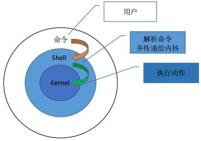
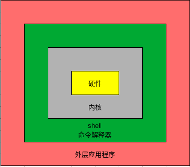

[toc]

# Bash Shell 编程

## 1. shell简介

shell是一个命令行解释器，它为用户提供了一个向Linux内核发送请求以便运行程序的界面系统级程序，用户可以用shell来启动、挂起、停止甚至编写一些程序

所以，shell是用户使用Linux的桥梁。shell既是一种命令语言，又是一种程序设计语言

 

 

学习shell编程的目的：

- Linux运维工程师在进行服务器集群管理时，需要编写shell程序来进行服务器管理
- 对于JavaEE和Python程序员来说，工作的需要。经常需要编写一些shell脚本进行程序或服务器的维护，比如编写一个定时备份数据库的脚本
- 对于大数据程序员，需要编写shell程序来管理集群

shell脚本，是一种为shell编写的脚本程序

我们所说的shell通常都是指shell脚本，但是shell和shell script是两个不同的概念

通常说shell编程，都是指shell脚本编程，而不是指开发shell本身

## 2. shell环境

shell编程与JavaScript、php编程一样，只要有一个能编写代码的文本编辑器和一个能解释执行的脚本解释器就可以了

Linux的shell种类很多，常见的有

- Bourne Shell(/usr/bin/sh或/bin/sh)
- Bourne Again Shell(/bin/bash)
- C Shell(/usr/bin/csh)
- K Shell(/usr/bin/ksh)
- Shell for Root(/sbin/sh)

本文所用到的shell环境为Bash(Bourne Again Shell)，由于易用和免费，Bash在日常工作中被广泛使用；同时，Bash也是大多数Linux系统默认的Shell

在一般情况下，并不区分Bourne Shell和Bourne Again Shell,所以，像 **#!/bin/sh** 同样可以改为 **#!/bin/bash** 

**#!** 告诉系统其后路径所指定的程序即是解释此脚本文件的Shell程序

## 3. shell脚本的执行方式

### (1). 脚本格式要求

- 脚本以 **#!/bin/bash** 开头
- 脚本需要有可执行权限
- 约定俗成，一般shell脚本文件都是以 **.sh** 作为扩展名

```bash
❯ # 创建一个shell脚本文件hello.sh
❯ nv hello.sh

#!/bin/bash
echo "Hello, World!"
```
注:

- **#!** 是一个约定的标记，它告诉系统这个脚本需要什么解释器来执行，即用那一种shell
- **echo** 命令用于向窗口输出文本

### (2). 运行shell脚本的2种方式

- **方式1 - 作为可执行程序**

```bash
❯ # 给脚本文件hello.sh添加执行权限
❯ sudo chmod u+x hello.sh
[sudo] password for cxy: 

❯ ls -l hello.sh
-rwxr--r--. 1 cxy cxy 33 Dec 30 13:45 hello.sh

❯ # 执行脚本文件hello.sh
❯ ./hello.sh
Hello, World! # 输出的内容
```
注意：一定要写成 **./hello.sh**，而不是**hello.sh** 

运行其它二进制程序也一样，直接写hello.sh，Linux系统会去PATH里寻找有没有名为hello.sh的文件，而当前目录可能不在环境变量PATH里，所以写成hello.sh会找不到命令。故而，要用./hello.sh告诉系统，就在当前目录找。或者使用文件的绝对路径/home/cxy/hello.sh

- **方式2 - 作为解释器的参数来运行**

这种运行方式是，直接运行解释器，其参数就是shell脚本文件的文件名hello.sh

这时，不需要在第一行指定解释器信息，即不需要#!/bin/bash这一行内容了

也可以不需要执行权限

```bash
❯ # 作为解释器参数运行脚本文件hello.sh
❯ /bin/sh ./hello.sh
Hello, World!
```
## 4. shell变量

### (1) 变量的类型

运行shell时，会同时存在3种变量

- **局部变量 - 自定义变量** 局部变量在脚本或命令中定义，仅在当前shell实例中有效，其它shell启动的程序不能访问局部变量
- **系统变量 - 环境变量** 所有的程序，包括shell启动的程序，都能访问环境变量，有些程序需要环境变量来保证其正常运行，必要的时候shell脚本也可以定义环境变量,下面的PATH、HOME都是环境变量
```bash
❯ echo ${PATH}
/usr/local/bin:/usr/bin
❯ echo ${HOME}
/home/cxy
```
		- 使用set命令可以显示所有的系统变量
- **shell变量** shell变量是由shell程序设置的特殊变量，shell变量中有一部分是环境变量，有一部分是局部变量，这些变量保证了shell的正常运行

### (2) 变量的定义

***基本语法***

`variable=value 即 变量名=值`

**定义变量的基本规则** 

- 等号两边不能有空格
- 变量名只能使用英文字母、数字和下划线构成
- 不能以数字开头
- 不能使用标点符号
- 不能使用bash中的关键字(可使用help命令查看保留关键字)
- 约定俗成，一般变量名习惯使用大写

| 有效的变量名    | 无效的变量名     |
| ------          | ------           |
| RUNOOB          | ?var=123         |
| LD_LIBRARY_PATH | user*name=runoob |
| _var            | 12fox            |
| var2            | %ab              |

***使用语句给变量赋值*** 

除了显式的直接赋值，还可以用语句给变量赋值

```bash
for file in `ls /etc`
或
for file in $(ls /etc)
```
以上语句将/etc目录下的文件名循环出来

***只读(静态)变量 - read only*** 

使用readonly命令可以将变量定义为只读变量，只读变量的值不能被改变

```bash
#!/bin/bash
myUrl="https://www.google.com" # 定义变量myUrl
readonly myUrl # 将变量myUrl设置为只读
myUrl="https://www.runoob.com" # 试图改变变量myUrl的值 - 结果不成功
# 运行后会输出如下结果
❯ sh ./readonly_var.sh
./readonly_var.sh: line 16: myUrl: readonly variable
```
### (3) 变量的使用

使用一个定义过的变量，只要在变量名前面加美元符号$即可

```bash
# 定义变量your_name
❯ your_name="jacky"
# 使用变量的方式1
❯ echo $your_name
jacky
# 使用变量的方式2
❯ echo ${your_name}
jacky

```
这里的\$your_name等价于\${your_name}

还可以这样使用变量

```bash
❯ A=100
❯ echo A=${A}
A=100
❯ echo A=$A
A=100
❯ echo "A=${A}"
A=100
❯ echo "A=$A"
A=100
```
这里的A=会原样输出，在遇到美元符号$后，其后面的内容会被解释器识别为变量，输出其值为100

变量名外面的花括号是可选的，加上花括号是为了帮助解释器识别变量的界

```bash
❯ for skill in Ada Coffe Action Java; do
for> echo "I am good at ${skill}Script"
for> done             
I am good at AdaScript
I am good at CoffeScript
I am good at ActionScript
I am good at JavaScript
```
如果不给skill变量加上花括号，写成echo "I am good at \$skillScript", 解释器就会把\$skillScript当成一个变量(其值为空)，代码就不是期望的输出结果了

```bash
❯ for skill in Ada Coffe Action Java; do
for> echo "I am good at $skillScript"
for> done             
I am good at 
I am good at 
I am good at 
I am good at
```
***推荐在使用变量时给所有变量加上花括号，这是一个好的编程习惯*** 

已经定义的变量，可以被重新定义

```bash
❯ your_name="tom" # 定义变量your_name
❯ echo ${your_name}
tom
# 重新定义变量your_name,注意不能加上$符号，只有在使用变量时才需要加上美元符号$
❯ your_name="jerry" # 重新定义变量your_name
❯ echo ${your_name}
jerry

```
### (4) 变量的删除 - unset

```bash
unset variable_name
```
变量被删除后不能再次使用

```bash
❯ myUrl="https://www.google.com" # 定义变量myUrl
❯ echo ${myUrl} # 显示变量
https://www.google.com
❯ unset myUrl # 删除变量
❯ echo ${myUrl} # 再次输出，结果为空

```
unset命令不能删除只读(静态)变量

```bash
❯ readonly mycat="tom" # 定义只读变量mycat
❯ unset mycat # 试图使用unset删除变量mycat - 结果不成功
zsh: read-only variable: mycat # 提示mycat是只读变量
```
### (5) 将命令的返回结果赋给变量

```bash
variable=`command` # 使用反引号``
或
variabel=$(command) # 使用小括号()
```
```bash
❯ # 将date命令的结果赋给变量
❯ C=`date`
❯ D=$(date)
❯ echo "C=${C}"
C=Wed Dec 30 22:33:32 CST 2020
❯ echo "D=${D}"
D=Wed Dec 30 22:33:45 CST 2020
```
### (6) 将变量设置为环境(全局/系统)变量

将变量设置为环境变量的目的:

- 可以实现在多个shell脚本中调用，从而避免了变量的重复定义
- 比如，a脚本文件中要使用变量TOMCAT_HOME，b脚本中也要使用变量TOMCAT_HOME
- 可以将TOMCAT_HOME设置成环境变量，这样就不需要分别在a脚本和b脚本中都定义TOMCAT_HOME变量了

***基本语法及步骤*** 

1. export variable=value # 将shell变量设置为环境变量
2. source configuration file(/etc/profile) # 让修改后的配置信息立即生效
3. echo ${variable} # 查询环境变量的值

***将/opt/tomcat设置为环境变量*** 

```bash
❯ # 编辑/etc/profile配置文件
❯ nv /etc/profile
# 打开这个文件,在最下面添加如下的语句
# 将Tomcat添加到环境变量
export TOMCAT_HOME=/opt/tomcat

# 保存退出

# 让修改后的配置信息立即生效
❯ source /etc/profile

# 查看是否成功设置成功
❯ echo ${TOMCAT_HOME}
/opt/tomcat
```
## 5. shell的注释方法

### (1) 单行注释

在行首加上#

```bash
# This is single row comment
```
### (2) 多行注释

```bash
:<<!
This is mulit-row comments
The quich brown fox jumps over a lazy dog
!
```
## 6. 位置参数变量

### (1) 位置参数变量简介

当我们执行一个shell脚本时，如果希望获取到命令行的参数信息，就可以使用到位置参数变量。比如`./myshell.sh 100 200`，这个就是一个执行shell脚本的命令行，可以在myshell.sh脚本中获取到参数信息(即获取到位置参数100或200)

### (2) 基本语法

| 语法   | 功能                   | 说明                     |
| ------ | ------                 | ------                   |
| ${0}   | 代表命令本身           | 即执行的脚本本身         |
| ${n}   | n为整数                | 表示第n个参数            |
| ${*}   | 命令行中所有的参数     | 所有的参数看成一个整体   |
| ${@}   | 命令行中所有的参数     | 每个参数区别对待         |
| ${#}   | 命令行中所有参数的个数 | 即命令行中共有多少个参数 |

\${*}与\${@}的区别

- 相同点:都是引用所有参数
- 不同点:只有在双引号中体现出来
    - 比如在脚本运行时写了3个参数1、2、3,则
    - ${*}等价于"1 2 3" - 即传递了一个参数
    - ${@}等价于"1" "2" "3" - 传递了三个参数

### (3) 举例说明

```bash
# myshell.sh
#!/bin/bash
echo "参数0=${0}"
echo "参数1=${1}"
echo "参数2=${2}"
echo "所有的参数(\${*}的结果)=${*}"
echo "所有的参数(\${@}的结果)=${@}"
echo "参数的总数=${#}"

执行并输出结果:
❯ ./myshell.sh 100 200 abc
参数0=./myshell.sh
参数1=100
参数2=200
所有的参数(${*}的结果)=100 200 abc
所有的参数(${@}的结果)=100 200 abc
参数的总数=3
```
## 7. 预定义变量

### (1) 简介

预定义变量就是shell设计者事先已经定义好的变量，可以直接在shell脚本中使用

### (2) 基本语法

|语法 |功能 |说明 |
|------ |------ |------ |
|$$ |当前进程的进程号PID |获取当前进程的PID |
|$! |后台运行的最后一个进程的进程号PID |获取其PID |
|$? |最后一次执行的命令的返回状态,正确与否 |若这个变量的值为0,则说明上一个命令正确执行;若是非0(具体由命令自己决定是那个数),则上一个命令执行不正确 |

### (3) 举例说明

```bash
# pre_var.sh
#!/bin/bash
echo "Present running process's ID is $$"
# 以后台的方式运行一个脚本，并获取它的进程号
/home/cxy/shcode/myshell.sh & # 这里的&符号表示在后台运行
echo "最后一个后台方式运行的进程的ID是:$!"
echo "执行的结果是:$?"

执行并输出结果
❯ ./pre_var.sh
Present running process's ID is 3716
最后一个后台方式运行的进程的ID是:3717
执行的结果是:0
参数0=/home/cxy/shcode/myshell.sh                                                                                                                   
参数1=
参数2=
所有的参数(${*}的结果)=
所有的参数(${@}的结果)=
参数的总数=0

```
## 8. shell运算符

shell和其它编程语言一样，支持多种运算符

- 算数运算符
- 关系运算符
- 布尔运算符
- 字符串运算符
- 文件测试运算符

原生bash不支持简单的数学运算，但是可以通过其它命令来实现，例如awk和expr，expr最常用

expr是一款表达式计算工具，使用它能完成表达式的求值操作

### (1) 运算式的3种方式

- \$((运算式))
- \$[运算式]
- expr m + n
    - expr 的表达式与运算符之间要有空格，比如expr 2 + 3，不能写成expr 2+3
    - 若要将expr的结果赋给一个变量，完整的表达式要使用反引号``包含
    - expr的乘法运算符要使用转义字符\转义；比如要计算2乘以3就要写成:expr 2 \\* 3

两个实例来说明

```bash
# 案例1 计算(2+3)*4的值
# 使用第1种方式 - $((expression))
RES1=$(((2+3)*4))
echo "res1=${RES1}"
# 使用第2种方式 - $[expression]
RES2=$[(2+3)*4]
echo "res2=${RES2}"
# 使用第3种方式 - expr expression
# 要分成2步
TEMP=`expr 2 + 3`
RES3=`expr ${TEMP} \* 4`
echo "res3=${RES3}"
# 案例2 求出命令行的两个参数(整数)的和
SUM=$[${1}+${2}]
echo "Sum is ${SUM}"
```

### (2) 算术运算符

下表列出了常用的算术运算符

假定变量a=10;变量b=20

|运算符 |说明 |写法1(\$((运算符))) |写法2(\$[运算符]) |写法3(expr m + n) |结果 |
|------ |------ |------ |------ |------ |------ |
|+ |加法 |\$((\${a}+\${b})) |\$[\${a}+\${b}] |\`expr \${a} + \${b}\` |30 |
|- |减法 |\$((\${a}-\${b})) |\$[\${a}-\${b}] |\`expr \${a} - \${b}` |-10 |
|* |乘法 |\$((\${a}*\${b})) |\$[\${a}*\${b}] |\`expr \${a} \\* \${b}` |200 |
|/ |除法 |\$((\${b}/\${a})) |\$[\${b}/\${a}] |\`expr \${b} / \${a}` |2 |
|% |取余 |\$((\${b}%\${a})) |\$[\${b}%\${a}] |\`expr \${b} % \${a}` |0 |
|= |赋值 |a=\${b} |把变量b的值赋给a | | |
|== |相等(比较两个数字) |[ \${a} == \${b} ] |相等,返回true |不等,返回false |false |
|!= |不相等(比较两个数字) |[ \${a} != \${b} ] |相等,返回false |不等,返回true |true |

**注意:条件表达式要放在方括号之间，并且要有空格** 

实例

```bash
# oper1.sh
#!/bin/bash

a=10
b=20

val=`expr ${a} + ${b}`
echo "a + b : ${val}"

val=`expr ${a} - ${b}`
echo "a - b : ${val}"

val=`expr ${a} \* ${b}`
echo "a * b : ${val}"

val=`expr ${b} / ${a}`
echo "b / a : ${val}"

val=`expr ${b} % ${a}`
echo "b % a : ${val}"

if [ ${a} == ${b} ]
then
    echo "a 等于 b"
fi
if [ ${a} != ${b} ]
then
    echo "a 不等于 b"
fi

运行结果
❯ ./oper1.sh
a + b : 30
a - b : -10
a * b : 200
b / a : 2
b % a : 0
a 不等于 b
```
### (3) 关系运算符

关系运算符只支持数字，不支持字符串，除非字符串的值是数字

下表列出了常用的关系运算符

假定变量a=10；变量b=20

|运算符 |说明 |举例 |结果 |
|------ |------ |------ |------ |
|-eq |检测两个数是否相等,相等返回true |[ ${a} -eq ${b} ] |false |
|-ne |检测两个数是否不相等,不等返回true |[ ${a} -ne ${b} ] |true |
|-gt |检测左边的数是否大于右边的,若是,则返回true |[ ${a} -gt ${b} ] |false |
|-lt |检测左边的数是否小于右边的,若是,则返回true |[ ${a} -lt ${b} ] |true |
|-ge |检测左边的数是否大于等于右边的,若是,则返回true |[ ${a} -ge ${b} ] |false |
|-le |检测左边的数是否小于等于右边的,若是,则返回true |[ ${a} -le ${b} ] |true |

实例

```bash
# relation_oper.sh
#!/bin/bash

a=10
b=20

if [ ${a} -eq ${b} ]
then
    echo "${a} -eq ${b} : a 等于 b"
else
    echo "${a} -eq ${b} : a 不等于 b"
fi

if [ ${a} -ne ${b} ]
then
    echo "${a} -ne ${b} : a 不等于 b"
else
    echo "${a} -ne ${b} : a 等于 b"
fi

if [ ${a} -gt ${b} ]
then
    echo "${a} -gt ${b} : a 大于 b"
else
    echo "${a} -gt ${b} : a 不大于 b"
fi

if [ ${a} -lt ${b} ]
then
    echo "${a} -lt ${b} : a 小于 b"
else
    echo "${a} -lt ${b} : a 不小于 b"
fi

if [ ${a} -ge ${b} ]
then
    echo "${a} -ge ${b} : a 大于或等于 b"
else
    echo "${a} -ge ${b} : a 小于 b"
fi

if [ ${a} -le ${b} ]
then
    echo "${a} -le ${b} : a 小于或等于 b"
else
    echo "${a} -le ${b} : a 大于 b"
fi

执行并输出结果
❯ ./relation_oper.sh
10 -eq 20 : a 不等于 b
10 -ne 20 : a 不等于 b
10 -gt 20 : a 不大于 b
10 -lt 20 : a 小于 b
10 -ge 20 : a 小于 b
10 -le 20 : a 小于或等于 b
```
### (4) 布尔运算符

常用的布尔运算符,假定变量a=10；变量b=20

| 运算符 | 说明                                             | 举例                            | 结果   |
| ------ | ------                                           | ------                          | ------ |
| !      | 非运算 表达式为true则返回false;为false则返回true | [ ! false ]                     | true   |
| -o     | 或运算 有一个表达式为true,则返回true             | [ ${a} -lt 20 -o ${b} -gt 100 ] | true   |
| -a     | 与运算 两个表达式都为true,才返回true             | [ ${a} -lt 20 -a ${b} -gt 100 ] | false  |

实例

```bash
❯ cat bool_oper.sh
#!/bin/bash

a=10
b=20

if [ ${a} != ${b} ]
then
    echo "${a} != ${b} : a 不等于 b"
else
    echo "${a} == ${b} : a 等于 b"
fi

if [ ${a} -lt 100 -a ${b} -gt 15 ]
then
    echo "${a} 小于 100 且 ${b} 大于 15 : 返回 true"
else
    echo "${a} 小于 100 且 ${b} 大于 15 : 返回 false"
fi

if [ ${a} -lt 100 -o ${b} -gt 100 ]
then
    echo "${a} 小于 100 或 ${b} 大于 100 : 返回 true"
else
    echo "${a} 小于 100 或 ${b} 大于 100 : 返回 false"
fi

if [ ${a} -lt 5 -o ${b} -gt 100 ]
then
    echo "${a} 小于 5 或 ${b} 大于 100 : 返回 true"
else
    echo "${a} 小于 5 或 ${b} 大于 100 : 返回 false"
fi

执行并输出结果
❯ ./bool_oper.sh
10 != 20 : a 不等于 b
10 小于 100 且 20 大于 15 : 返回 true
10 小于 100 或 20 大于 100 : 返回 true
10 小于 5 或 20 大于 100 : 返回 false
```

<++>
