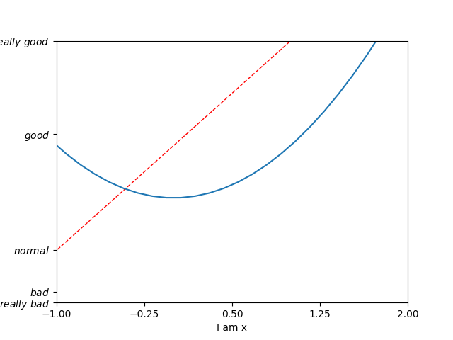
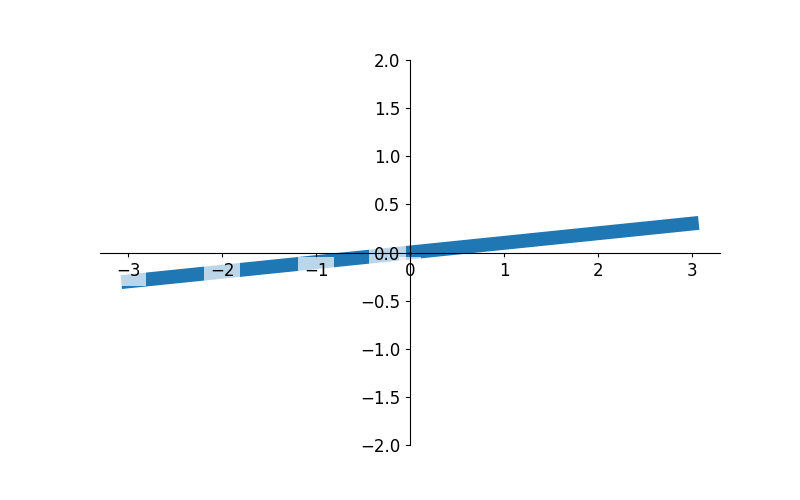

# 数据分析numpy、matplotlib、pandas

## 1. 简述数据分析

### 1. 数据分析简介

- 数据分析指用适当的统计、分析方法对收集来的大量数据进行分析，将它们加以汇总和理解并消化，以求最大化地开发数据的功能，发挥数据的作用。数据分析是为了提取有用信息和形成结论而对数据加以详细研究和概括总结的过程
- 数据也称为观测值，是实验、测量、观察、调查等的结果。数据分析中所处理的数据分为定性数据和定量数据。只能归入某一类而不能用数值进行测度的数据称为定性数据。定性数据中表现为类别，但不区分顺序的，是定类数据，如性别、品牌等；定性数据中表现为类别，但区分顺序的，是定序数据，如学历、商品的质量等级等

### 2. 数据分析到目的

- 数据分析的目的是把隐藏在一大批看来杂乱无章的数据中的信息集中和提炼出来，从而找出所研究对象的内在规律。在实际应用中，数据分析可帮助人们做出判断，以便采取适当行动。数据分析是有组织有目的地收集数据、分析数据，使之成为信息的过程。这一过程是质量管理体系的支持过程。在产品的整个寿命周期，包括从市场调研到售后服务和最终处置的各个过程都需要适当运用数据分析过程，以提升有效性。例如设计人员在开始一个新的设计以前，要通过广泛的设计调查，分析所得数据以判定设计方向，因此数据分析在工业设计中具有极其重要的地位
- 数据分析是Python数据科学的基础
- 数据分析是机器学习的基础

## Matplotlib基本操作

### 1. 安装

```bash
pip install --user matplotlib
```

### 2. 导入包

```python
from matplotlib import pyplot as plt
```

### 3. 基本流程

```python
from matplotlib import pyplot as plt

x = range(2, 26, 2)  # x轴的数据 - 可迭代对象
y = [15, 13, 14.5, 17, 20, 25, 26, 26, 24, 22, 18, 15]  # y轴的数据 - 可迭代对象
# x轴和y轴的数据一起组成了要绘制的坐标,即(2,15)(4,13)(6,14.5)...这样的坐标点
# 绘制折线图
plt.plot(x, y)
# 程序执行时展示图形
plt.show()
```
生成的折线图图形是这样的:

 

### 4. Figure

可以使用figure()方法画多个图形

```python
from matplotlib import pyplot as plt
import numpy as np


class MatplotlibFigure(object):
    """Matplotlib的figure方法"""
    def __init__(self):
        super(MatplotlibFigure, self).__init__()
        # x轴的数据
        self.x = np.linspace(-1, 1, 50)
        # y轴的数据
        self.y1 = self.x * 2 + 1
        self.y2 = self.x ** 2

    def generate_figure(self):
        """生成图形"""
        # 第一个图形 - 以y1为y轴数据
        plt.figure()
        plt.plot(self.x, self.y1)
        # 第二个图形 - 以y2为y轴数据
        plt.figure(num=5)
        plt.plot(self.x, self.y1)
        # 设置一些属性 - 颜色、线条宽度、线条样式
        plt.plot(self.x, self.y2, color='red', linewidth=5, linestyle='dashdot')
        plt.show()


if __name__ == "__main__":
    mf = MatplotlibFigure()
    mf.generate_figure()
```

### 5. 设置坐标轴

```python
from matplotlib import pyplot as plt
import numpy as np


class AxesSetting(object):
    """设置坐标轴"""
    def __init__(self):
        super(AxesSetting, self).__init__()
        # x轴的数据
        self.x = np.linspace(-3, 3, 50)
        # y轴的数据
        self.y1 = self.x * 2 + 1
        self.y2 = self.x ** 2
        # 坐标轴的刻度
        self.new_ticks = np.linspace(-1, 2, 5)

    def generate_figure(self):
        """生成图形"""
        plt.figure()
        plt.plot(self.x, self.y1, color='red', linewidth=1.0, linestyle='--')
        plt.plot(self.x, self.y2)

        # 设置数据区间
        plt.xlim((-1, 2))
        plt.ylim((-2, 3))
        # 设置坐标轴标签
        plt.xlabel('I am x')
        plt.ylabel('I am y')

        # 设置坐标轴刻度
        plt.xticks(self.new_ticks)
        # 同时对y轴的刻度字体进行了一些修饰 - 支持正则与Latex
        plt.yticks([-2, -1.8, -1, 1.22, 3],
                [r'$really\ bad$', '$bad$', '$normal$', '$good$', r'$really\ good$'])

        # 显示图形
        plt.show()


if __name__ == "__main__":
    st = AxesSetting()
    st.generate_figure()
```
 

```python
from matplotlib import pyplot as plt
import numpy as np


class SettingAxes(object):
    """docstring for SettingAxes"""
    def __init__(self):
        super(SettingAxes, self).__init__()
        self.x = np.linspace(-3, 3, 50)
        self.y1 = self.x * 2 + 1
        self.y2 = self.x ** 2
        self.new_ticks = np.linspace(-1, 2, 5)

    def generate_figure(self):
        plt.figure()
        plt.plot(self.x, self.y1)
        plt.plot(self.x, self.y2, color='green', linewidth=1.0, linestyle='--')

        # 设置数据区间
        plt.xlim((-1, 2))
        plt.ylim((-2, 3))
        # 设置坐标轴标签
        plt.xlabel('I am x')
        plt.ylabel('I am y')

        # 设置坐标轴刻度
        plt.xticks(self.new_ticks)
        plt.yticks([-2, -1.8, -1, 1.22, 3],
                [r'$really\ bad$', r'$bad$', r'$normal$', r'$good$', r'$really\ good$'])

        # 获取坐标轴 gca - get current axis
        ax = plt.gca()
        # 设置图片边框线颜色
        ax.spines['right'].set_color('none')
        ax.spines['top'].set_color('none')

        # 设置坐标原点
        ax.xaxis.set_ticks_position('bottom')  # x轴刻度在底部
        ax.yaxis.set_ticks_position('left')  # y轴刻度在左侧
        # 设置坐标原点到(0,0)点处
        ax.spines['bottom'].set_position(('data', 0))
        ax.spines['left'].set_position(('data', 0))

        plt.show()


if __name__ == "__main__":
    sa = SettingAxes()
    sa.generate_figure()
```
 

### 6. 图例legend

```python
from matplotlib import pyplot as plt
import numpy as np


class LengendSetting(object):
    """docstring for LengendSetting"""
    def __init__(self):
        super(LengendSetting, self).__init__()
        self.x = np.linspace(-3, 3, 50)
        self.y1 = self.x * 2 + 1
        self.y2 = self.x ** 2
        self.new_ticks = np.linspace(-1, 2, 5)

    def generate_figure(self):
        plt.figure()
        plt.xlim((-1, 2))
        plt.ylim((-2, 3))
        plt.xlabel('I am x')
        plt.ylabel('I am y')
        plt.xticks(self.new_ticks)
        plt.yticks([-2, -1.8, -1, 1.22, 3],
                [r'$really\ bad$', r'$bad$', r'$normal$', r'$good$', r'$really\ good$'])
        # 要加上一个逗号
        l1, = plt.plot(self.x, self.y2, color='red', linestyle='--', label='Up')
        l2, = plt.plot(self.x, self.y1, label='Down')

        # 使用labels参数就不再使用上面设置的label了
        plt.legend(handles=[l1, l2], labels=['Conic', 'Straight line'], loc='best')

        plt.show()


if __name__ == "__main__":
    ls = LengendSetting()
    ls.generate_figure()
```


### 7. 标注annotation

添加标注有2种方法：

- annotate()方法
- text()方法

```python
from matplotlib import pyplot as plt
import numpy as np


class AddAnnotation(object):
    """docstring for AddAnnotation"""
    def __init__(self):
        super(AddAnnotation, self).__init__()
        self.x = np.linspace(-3, 3, 50)
        self.y = self.x * 2 + 1

    def generate_figure(self):
        plt.figure(num=1, figsize=(8, 5))
        plt.plot(self.x, self.y)

        ax = plt.gca()
        ax.spines['right'].set_color('none')
        ax.spines['top'].set_color('none')

        ax.xaxis.set_ticks_position('bottom')
        ax.yaxis.set_ticks_position('left')

        ax.spines['bottom'].set_position(('data', 0))
        ax.spines['left'].set_position(('data', 0))

        # 画出点(1, 3)即x=1,y=2×1+1=3
        x0 = 1
        y0 = 2 * x0 + 1
        plt.scatter(x0, y0, color='green', s=50)
        # 从该点画一条垂线与x轴相交
        plt.plot([x0, x0], [y0, 0], 'k--', lw=2.5)  # k--表示黑色短划线

        # 添加标注 - 方法1 -画一个箭头指向该点，并标注说明文字2x+1=3
        plt.annotate(r'$2x + 1 = %s$' % y0, 
                xy=(x0, y0), xycoords='data',
                xytext=(+30, -30), textcoords='offset points',
                fontsize=16,
                arrowprops=dict(arrowstyle='->', connectionstyle='arc3, rad=.2', color='red'))
        # 添加标注 - 方法2 - 添加一段文字描述
        plt.text(-3.7, 7, r'$The\ quick\ brown\ fox\ jumps\ over\ a\ lazy\ dog.\ \mu\ \sigma_i\ \alpha^t$',
                fontdict={'size': 16, 'color': 'red'})

        plt.show()


if __name__ == "__main__":
    aa = AddAnnotation()
    aa.generate_figure()
```


### 8. 透明度transparency

由于图形的宽度等原因导致遮盖了图形下面的一些数据，比如

 

为了将下面的数据显现出来，可以设置图形的zorder(z-order),即显示顺序，zorder的数值越大，图像就越会显示在上方

具体参考[Matplotlib zorder](https://matplotlib.org/gallery/misc/zorder_demo.html#sphx-glr-gallery-misc-zorder-demo-py) 

```python
from matplotlib import pyplot as plt
import numpy as np


class Transparency(object):
    """docstring for AddAnnotation"""
    def __init__(self):
        self.x = np.linspace(-3, 3, 50)
        self.y = self.x * 0.1

    def generate_figure(self):
        plt.figure(num=1, figsize=(8, 5))
        # 设置zorder=1
        plt.plot(self.x, self.y, linewidth=10, zorder=1)
        plt.ylim(-2, 2)

        ax = plt.gca()
        ax.spines['right'].set_color('none')
        ax.spines['top'].set_color('none')

        ax.xaxis.set_ticks_position('bottom')
        ax.yaxis.set_ticks_position('left')

        ax.spines['bottom'].set_position(('data', 0))
        ax.spines['left'].set_position(('data', 0))

        # 对标签的字体和边框进行设置
        for label in ax.get_xticklabels() + ax.get_yticklabels():
            label.set_fontsize(12)
            # bbox - bounding box
            label.set_bbox(dict(facecolor='white', edgecolor='None', alpha=0.7))

        plt.show()


if __name__ == "__main__":
    t = Transparency()
    t.generate_figure()
```


### 9. 散点图Scatter

```python
from matplotlib import pyplot as plt
import numpy as np


class MatplotlibScatter(object):
    """散点图"""
    def __init__(self):
        super(MatplotlibScatter, self).__init__()
        self.n = 1024
        self.X = np.random.normal(0, 1, self.n)
        self.Y = np.random.normal(0, 1, self.n)
        # 设置颜色
        self.T = np.arctan2(self.Y, self.X)

    def generate_figure(self):
        plt.scatter(self.X, self.Y, s=75, c=self.T, alpha=0.5)
        plt.xlim(-1.5, 1.5)
        plt.ylim(-1.5, 1.5)
        # 隐藏x、y轴的刻度
        plt.xticks(())
        plt.yticks(())
        plt.show()


if __name__ == "__main__":
    ms = MatplotlibScatter()
    ms.generate_figure()
```
 

### 10. 柱状图Bar

```python
from matplotlib import pyplot as plt
import numpy as np


class MatplotlibBar(object):
    """柱状图"""
    def __init__(self):
        super(MatplotlibBar, self).__init__()
        self.n = 12
        self.X = np.arange(self.n)
        self.Y1 = (1 - self.X / float(self.n)) * np.random.uniform(0.5, 1.0, self.n)
        self.Y2 = (1 - self.X / float(self.n)) * np.random.uniform(0.5, 1.0, self.n)

    def generate_figure(self):
        plt.xlim(-.5, self.n)
        plt.ylim(-1.25, 1.25)

        plt.xticks(())
        plt.yticks(())

        # 绘制柱状图
        plt.bar(self.X, +self.Y1, facecolor='#9999ff', edgecolor='white')
        plt.bar(self.X, -self.Y2, facecolor='#ff9999', edgecolor='white')

        # 在柱状图的顶/底部添加对应数字标签
        # ha - horizotal alignment; va - vertical alignment
        for x, y in zip(self.X, self.Y1):
            plt.text(x, y, '%.2f' % y, ha='center', va='bottom')
        for x, y in zip(self.X, self.Y2):
            plt.text(x, -(y), '%.2f' % y, ha='center', va='top')

        plt.show()


if __name__ == "__main__":
    mb = MatplotlibBar()
    mb.generate_figure()
```
 

### 11. 等高线图contour

```python
from matplotlib import pyplot as plt
import numpy as np


class MatplotlibContour(object):
    """等高线图"""
    def __init__(self):
        super(MatplotlibContour, self).__init__()
        self.n = 256
        self.x = np.linspace(-3, 3, self.n)
        self.y = np.linspace(-3, 3, self.n)
        self.X, self.Y = np.meshgrid(self.x, self.y)

    def contour(self, x, y):
        """生成高程的函数"""
        return (1 - x / 2 + x ** 5 + y ** 3) * np.exp(-x ** 2 - y ** 2)

    def generate_figure(self):
        """画等高线"""
        # 填充等高线底色
        # 数字8这里表示的是等高线的疏密程度
        plt.contourf(self.X, self.Y, self.contour(self.X, self.Y), 8, alpha=0.75, cmap=plt.cm.hot)
        # 添加等高线
        C = plt.contour(self.X, self.Y, self.contour(self.X, self.Y), 8, colors='black', linewidths=.5)
        # 在等高线上添加高程数字标签
        plt.clabel(C, inline=True, fontsize=10)

        plt.xticks(())
        plt.yticks(())

        plt.show()


if __name__ == "__main__":
    mc =MatplotlibContour()
    mc.generate_figure()
```
 

### 12. 图像image

```python
#!/usr/bin/env python3
# encoding: utf-8
# coding style: pep8
# ====================================================
#   Copyright (C) 2020 cxysailor-master All rights reserved.
#
#   Author        : cxysailor
#   Email         : cxysailor@163.com
#   File Name     : matplotlib_image.py
#   Last Modified : 2020-12-10 23:01
#   Describe      : 
#
# ====================================================

from matplotlib import pyplot as plt
import numpy as np


class MatplotlibImage(object):
    """docstring for MatplotlibImage"""
    def __init__(self):
        super(MatplotlibImage, self).__init__()
        # 图片数据
        self.a = np.array([
            0.313660827978, 0.36534818405, 0.423733120134,
            0.36534818405, 0.439599930621, 0.525083754405,
            0.423733120134, 0.525083754405, 0.651536351379
        ]).reshape(3, 3)

    def generate_figure(self):
        # 根据数据画图
        plt.imshow(self.a, interpolation='nearest', cmap='bone', origin='lower')
        # 添加颜色条
        plt.colorbar()

        plt.xticks(())
        plt.yticks(())

        plt.show()


if __name__ == "__main__":
    mi = MatplotlibImage()
    mi.generate_figure()
```
 

### 13. 3D数据

```python
#!/usr/bin/env python3
# encoding: utf-8
# coding style: pep8
# ====================================================
#   Copyright (C) 2020 cxysailor-master All rights reserved.
#
#   Author        : cxysailor
#   Email         : cxysailor@163.com
#   File Name     : matplotlib_3d.py
#   Last Modified : 2020-12-11 22:27
#   Describe      : 
#
# ====================================================

from matplotlib import pyplot as plt
import numpy as np
from mpl_toolkits.mplot3d import Axes3D


class Mpl3D(object):
    """docstring for Mpl3D"""
    def __init__(self):
        super(Mpl3D, self).__init__()
        self.x = np.arange(-4, 4, 0.25)
        self.y = np.arange(-4, 4, 0.25)

    def generate_figure(self):
        fig = plt.figure()
        ax = Axes3D(fig)
        X, Y = np.meshgrid(self.x, self.y)
        R = np.sqrt(X ** 2 + Y ** 2)
        Z = np.sin(R)

        ax.plot_surface(X, Y, Z, rstride=1, cstride=1, cmap=plt.get_cmap('rainbow'))
        ax.contourf(X, Y, Z, zdir='z', offset=-2, cmap='rainbow')
        ax.set_zlim3d(-2, 2)

        plt.show()


if __name__ == "__main__":
    md = Mpl3D()
    md.generate_figure()
```
 

### 14. 子图形subplot()

```python
#!/usr/bin/env python3
# encoding: utf-8
# coding style: pep8
# ====================================================
#   Copyright (C) 2020 cxysailor-master All rights reserved.
#
#   Author        : cxysailor
#   Email         : cxysailor@163.com
#   File Name     : matplotlib_subplot.py
#   Last Modified : 2020-12-13 10:20
#   Describe      : 
#
# ====================================================

from matplotlib import pyplot as plt

# 父图形
plt.figure()

# 第1个子图形
plt.subplot(2, 2, 1)  # 分成2行2列,在第1个位置画子图形
# 在子图形中画一条直线
plt.plot([0, 1], [0, 1])  # x轴数据[0,1],y轴数据[0,1]

# 第2个子图形
plt.subplot(2, 2, 2)  # 分成2行2列,在第2个位置画子图形
# 在子图形中画一条直线
plt.plot([0, 1], [0, 2])  # x轴数据[0,1],y轴数据[0,2]

# 第3个子图形
plt.subplot(223)  # 分成2行2列,在第3个位置画子图形;可以不使用逗号
# 在子图形中画一条直线
plt.plot([0, 1], [0, 3])  # x轴数据[0,1],y轴数据[0,3]

# 第4个子图形
plt.subplot(224)  # 分成2行2列,在第4个位置画子图形;可以不使用逗号
# 在子图形中画一条直线
plt.plot([0, 1], [0, 4])  # x轴数据[0,1],y轴数据[0,4]

plt.show()
```


现在把第一个子图形设置成占用3列

```python
#!/usr/bin/env python3
# encoding: utf-8
# coding style: pep8
# ====================================================
#   Copyright (C) 2020 cxysailor-master All rights reserved.
#
#   Author        : cxysailor
#   Email         : cxysailor@163.com
#   File Name     : matplotlib_subplot.py
#   Last Modified : 2020-12-13 10:59
#   Describe      : 
#
# ====================================================

from matplotlib import pyplot as plt

# 父图形
plt.figure()

# 第1个子图形
plt.subplot(2, 1, 1)  # 分成2行1列,在第1行第1个位置画子图形,这样这个子图形就占用了上面一整行
# 在子图形中画一条直线
plt.plot([0, 1], [0, 1])  # x轴数据[0,1],y轴数据[0,1]

# 第2个子图形
plt.subplot(2, 3, 4)  # 分成2行3列,在第2行第1个位置画子图形(从第一行开始数)
# 在子图形中画一条直线
plt.plot([0, 1], [0, 2])  # x轴数据[0,1],y轴数据[0,2]

# 第3个子图形
plt.subplot(235)  # 分成2行3列,在第2行第2个位置画子图形;可以不使用逗号
# 在子图形中画一条直线
plt.plot([0, 1], [0, 3])  # x轴数据[0,1],y轴数据[0,3]

# 第4个子图形
plt.subplot(236)  # 分成2行2列,在第2行第3个位置画子图形;可以不使用逗号
# 在子图形中画一条直线
plt.plot([0, 1], [0, 4])  # x轴数据[0,1],y轴数据[0,4]

plt.show()
```
 

