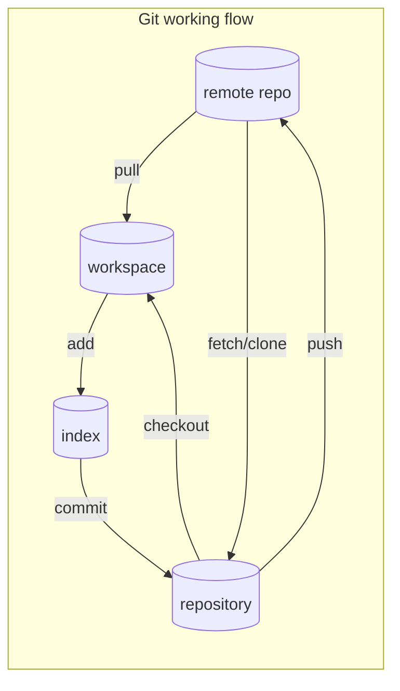

# Git and Github的简单操作

## 1. 工作流程图


## 2. git初始化

### 2.1 设置用户名和email

```bash
git config --global user.username "username"

git config --global user.email "user email"
```

### 2.2 初始化git

创建并切换到一个目录test

在test目录中执行

```bash
git init
```

即在test目录初始化一个git仓库，该目录下会有一个名为.git的目录.Git用来管理仓库的文件都存储在这个目录中，

我们不需要与这个目录打交道。**但是千万不要将其删除，否则将丢弃项目的所有历史记录!** 

删除.git目录不会影响test目录下的文件的，仅仅是删除了Git仓库及其记录。

### 2.3 忽略.pyc文件

扩展名为.pyc的文件是根据.py文件自动生成的，无需让Git跟踪它们。这些文件存储中__pycache__中。

为让Git忽略这个目录，在test目录下创建一个.gitignore的特殊文件，并在其中写入__pycache__

```bash
vim .gitignore 创建.gitignore文件

在文件中写入下面的内容，保存退出即可

__pycache__
```

保存退出即可.

## 3. 查看Git状态

```bash
git status

位于分支 master
未跟踪的文件:
  （使用 "git add <文件>..." 以包含要提交的内容）
        mdfile/git_commands.md

提交为空，但是存在尚未跟踪的文件（使用 "git add" 建立跟踪）
```

## 4. 将文件加入到仓库中

Git在本地可以分为3个部分：工作区、缓存区、归档区，分别对应了上面流程图中的workspace、index、repository。

文件是先使用git add命令添加到缓存区index，再通过git commit命令提交到归档区repository

### 4.1 使用git add命令添加到缓存区index

`git add .` 添加所有文件

`git add file` 添加文件file 

```bash
❯ git add .
❯ git status
位于分支 master
要提交的变更：
  （使用 "git restore --staged <文件>..." 以取消暂存）
        新文件：   mdfile/git_commands.md

```

### 4.2 使用git commit命令提交到归档区repository

```bash
❯ git commit -am "New git.md"  # 参数-a表示all；-m表示message
[master 1df51b7] New git.md
 1 file changed, 93 insertions(+)
 create mode 100644 mdfile/git_commands.md

```

再次查看状态

```bash
❯ git status
位于分支 master
无文件要提交，干净的工作区

```
添加完成。

## 5. 查看提交历史记录

`git log`  查看历史记录的所有信息:40个字符的引用ID、执行提交人、提交时间、指定的消息

`git log --pretty=oneline`   指定显示2项重要的信息：引用ID、为提交记录的消息

```bash<++ <++> <++> 
❯ git log

commit 1df51b7e1f5ed9ae70e9b305c72782236f6602dd (HEAD -> master)
Author: cxysailor <cxysailor@163.com>
Date:   Thu Aug 20 20:56:12 2020 +0800

    New git.md

commit b7cd0a5b083a7cf56b78277e7035ef10d49fc654 (origin/master)
Author: cxysailor <cxysailor@163.com>
Date:   Thu Aug 20 16:09:53 2020 +0800

    Add .gitignore

commit f4c26080c888a4f8166b0951a7250e1954b3d84b
Author: cxysailor <cxysailor@163.com>
Date:   Thu Aug 20 16:09:06 2020 +0800

    Git initialization

❯ git log --pretty=oneline

1df51b7e1f5ed9ae70e9b305c72782236f6602dd (HEAD -> master) New git.md
b7cd0a5b083a7cf56b78277e7035ef10d49fc654 (origin/master) Add .gitignore
f4c26080c888a4f8166b0951a7250e1954b3d84b Git initialization

```

## 6. 撤销修改

`git checkout` 能够恢复到以前的任何修改

### 6.1 放弃自最后一次所做的所有修改，将项目恢复到最后一次提交的状态

`git checkout .` 

### 6.2 恢复到以前的提交状态

`git checkout ID的前6个字符` 根据引用ID的前6个字符，检出前面的提交记录

`git reset --hard ID的前6个字符` 恢复到该ID的提交状态

## 7. 删除仓库

**尽量不要删除仓库，除非你确定要这么做！** 

当然，删除仓库仅仅是删除来Git的跟踪历史记录，并不会影响到任何文件的当前状态

可以使用文件浏览器进入到项目目录test，删除其中的./git目录；

也可以使用命令行

```bash
cd test

rm -rf .git
```

## 8. 分支

到目前，一直都是中Git默认的分支master中操作。当需要多个人一起协同开发时，需要为每个人创建一个分支，以避免相互影响

### 8.1 查看分支状态

`git branch -v` 

`* master 1df51b7 New git.md
` 

### 8.2 创建分支

`git branch <name>` 

### 8.3 切换分支

`git checkout <name>` 

`git switch <name>` 

### 8.4 创建并快速切换到分支

`git checkout -b branch1`  创建了一个分支branch1，并直接切换到该分支

`git switch -c <name>` 

相当于执行了

`git branch branch1` 

`git checkout branch1` 

2条命令

### 8.4 切换分支

`git checkout first`  切换到分支first

### 8.5 合并分支

`git merge <name>`  将分支name合并到当前分支

`git merge master/first`  将first分支合并到master分支

## 9. 远程仓库

### 9.2 注册Github并创建一个仓库

需要到[Github](https://github.com) 上先行注册一个帐号

使用注册的帐号登录Github，在右上角的十字处点击，弹出的菜单中选择"New repository"创建一个仓库

### 9.2 在本地添加一个远程仓库

进入test目录,执行下面的命令添加远程仓库

`git remote add origin https://github.com/your_github_id/your_repository.git` 

注：
- git remote add 添加远程仓库的命令
- origin Github默认的远程库的名称，也可以定义为其他的，但大家习惯使用这个名字，一看就是远程的仓库
- your_github_id Github上注册的账户名
- your_repository.git Github上创建的仓库名称

这样添加的是https协议的仓库，不仅速度慢，而且每次推送到仓库的时候都会提示输入帐号和密码

为了避免每次都输入帐号与密码，可以改成ssh协议的仓库

- 本地生成ssh key, `ssh-keygen -t rsa -b 4096 -C "your_email@example.com"` 双引号内的内容换成注册Github时用的email
- 会在~/.ssh/目录下生成两个文件id_rsa和id_rsa.pub
- 复制id_rsa中的key添加到Github中
- 如果提示"Key is invalid. You must supply a key in OpenSSH public key format",则复制id_rsa.pub中的key
- 登录Github，点开右上角帐号头像，弹出的菜单中选择"Settings"
- 打开的页面中，选择左侧列表的"SSH and GPG keys"
- 将上面复制的key添加到"SSH Keys"中
- 在Github上仓库首页的绿色"Code"按钮下面，点一下"use SSH"
- 将新的地址复制下来
- 使用`git remote remove origin` 删除旧的https协议远程仓库
- 重新添加新的ssh协议仓库`git remote add origin git@github.com:your_github_id/your_repository.git` 

注意比较两次添加的仓库地址的区别

这样，以后再推送的时候就不需要输入帐号和密码了。

## 10. 将本地库推送到远程仓库

远程仓库添加完成后，就可以将本地仓库添加到远程了。其实是将master分支推送到远程仓库origin.

`git push -u origin master` 

由于远程库是空的，我们第一次推送master分支时，加上了-u参数，Git不但会把本地的master分支内容推送的远程新的master分支，还会把本地的master分支和远程的master分支关联起来，在以后的推送或者拉取时就可以简化命令.

推送成功后，就可以在Github的页面上看到远程库和本地完全一样的内容

以后每次本地内容修改后，就可以使用`git push origin master` 将本地修改推送到远程仓库了。

## 11. SSH警告

当你第一次使用Git的clone或者push命令连接GitHub时，会得到一个警告：

```bash
The authenticity of host 'github.com (xx.xx.xx.xx)' can't be established.
RSA key fingerprint is xx.xx.xx.xx.xx.
Are you sure you want to continue connecting (yes/no)?
```

这是因为Git使用SSH连接，而SSH连接在第一次验证GitHub服务器的Key时，需要你确认GitHub的Key的指纹信息是否真的来自GitHub的服务器，输入yes回车即可。

Git会输出一个警告，告诉你已经把GitHub的Key添加到本机的一个信任列表里了：

Warning: Permanently added 'github.com' (RSA) to the list of known hosts.

这个警告只会出现一次，后面的操作就不会有任何警告了。

如果你实在担心有人冒充GitHub服务器，输入yes前可以对照GitHub的RSA Key的指纹信息是否与SSH连接给出的一致

## 12. 从远程仓库克隆

如果是从零开始，最好的方法是从远程克隆到本地。即先在远程创建一个仓库，再克隆到本地。

1. 登录Github，创建一个仓库名为test_repo
2. `git clone git@github.com:github_id/test_repo.git ~/local_path` 
3. 本地~/local_path目录就会生成一个名为test_repo的目录,克隆成功
4. 如果是多人协作开发，则每个人都克隆一份即可

```git
cxysailor@cxy-Desktop MINGW64 ~/Desktop
$ git clone git@github.com:cxysailor/my-learning-note.git k:\python_learning
Cloning into 'k:python_learning'...
remote: Enumerating objects: 1159, done.
remote: Counting objects: 100% (1159/1159), done.
remote: Compressing objects: 100% (1051/1051), done.
remote: Total 1159 (delta 97), reused 1151 (delta 95), pack-reused 0
Receiving objects: 100% (1159/1159), 20.08 MiB | 19.00 KiB/s, done.
Resolving deltas: 100% (97/97), done.

```

## 13. 解决冲突

当Git无法自动合并分支时，就必须首先解决冲突。解决冲突后，再提交，合并完成。

解决冲突就是把Git合并失败的文件手动编辑为我们希望的内容，再提交。

用git log --graph命令可以看到分支合并图

以上列出来git与github的一些基本操作，具体详细的内容请参考Github。

## 14. 关于Error: Permission denied (publickey)错误提示到解决

参看[Error: Permission denied (publickey)](https://docs.github.com/en/free-pro-team@latest/github/authenticating-to-github/error-permission-denied-publickey) 
