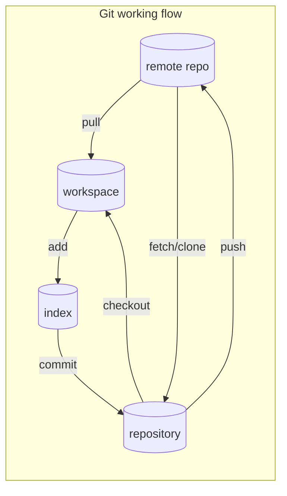

# Git and Github的简单操作

## 1. 工作流程图


## 2. git初始化

### 2.1 设置用户名和email

```bash
git config --global user.username "username"

git config --global user.email "your email"
```

### 2.2 初始化git

创建并切换到一个目录test

在test目录中执行

```bash
git init
```

即在test目录初始化一个git仓库，该目录下会有一个名为.git的目录.Git用来管理仓库的文件都存储在这个目录中，

我们不需要与这个目录打交道。**但是千万不要将其删除，否则将丢弃项目的所有历史记录!** 

删除.git目录不会影响test目录下的文件的，仅仅是删除了Git仓库及其记录。

### 2.3 忽略.pyc文件

扩展名为.pyc的文件是根据.py文件自动生成的，无需让Git跟踪它们。这些文件存储中__pycache__中。

为让Git忽略这个目录，在test目录下创建一个.gitignore的特殊文件，并在其中写入__pycache__

```bash
vim .gitignore

__pycache__
```

保存退出即可.

## 3. 查看Git状态

```bash
git status

位于分支 master
未跟踪的文件:
  （使用 "git add <文件>..." 以包含要提交的内容）
        mdfile/git_commands.md

提交为空，但是存在尚未跟踪的文件（使用 "git add" 建立跟踪）
```

## 4. 将文件加入到仓库中

Git在本地可以分为3个部分：工作区、缓存区、归档区，分别对应来上面流程图中的workspace、index、repository。

文件是先使用git add命令添加到缓存区index，再通过git commit命令提交到归档区repository

### 4.1 使用git add命令添加到缓存区index

`git add .` 添加所有文件

`git add file` 添加文件file 

```bash
❯ git add .
❯ git status
位于分支 master
要提交的变更：
  （使用 "git restore --staged <文件>..." 以取消暂存）
        新文件：   mdfile/git_commands.md

```


