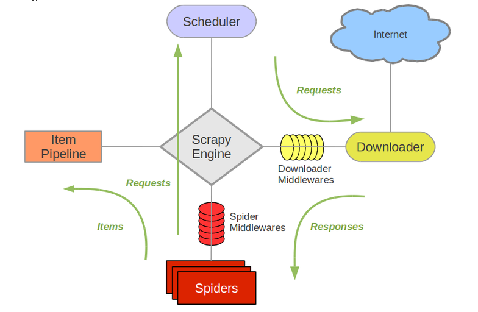

# Scrapy框架

## 1. 简介

框架就是一个集成了很多功能，并且具有很强的通用性的项目模板.

Scrapy就是爬虫中封装好的一个框架

Scrapy框架封装的主要功能：
1. 高性能的持久化存储
2. 异步的数据下载
3. 高性能的数据解析
4. 分布式

## 2. 环境安装

**Mac OS 或者Linux系统** 

`pip install --user scrapy` 

**Windows系统** 

-  pip install --user wheel
-  下载twisted [twisted](https://www.lfd.uci.edu/~gohlke/pythonlibs/#twisted) 
-  安装twisted pip install Twisted‑20.3.0‑cp38‑cp38‑win_amd64.whl  # 下载windows平台的对应python版本的安装包
-  pip install --user pywin32
-  pip install --user scrapy

现在比较简单了，Windows系统下直接使用pip就可以安装妥了

在终端命令行输入scrapy，如果没有错误提示，则说明安装好了

## 3. 创建scrapy项目

scrapy项目需要2步
- 创建工程
- 创建一个爬虫程序

### 3.1 创建一个工程

创建一个目录，比如scrapy_project，进入这个目录，使用

`scrapy startproject project_name` 命令

```bash
❯ scrapy startproject first_blood
New Scrapy project 'first_blood', using template directory '/home/cxy/.local/lib/python3.8/site-packages/scrapy/templates/project', created in:
    /home/cxy/python_learning/crawler/scrapy_project/first_blood

You can start your first spider with:
    cd first_blood
    scrapy genspider example example.com
```
说明已经创建了名为first_blood的工程

同时，也提示了，进入first_blood目录，创建一个scrapy爬虫程序

先不忙着创建程序，先来看看生成了什么

这个目录下多了一个与工程同名的目录

```bash
❯ ls
first_blood

```

再看看这个目录下有什么

```bash
❯ cd first_blood
❯ ls -l
总用量 4
drwxr-xr-x 3 cxy cxy 117  9月  2 20:35 first_blood
-rw-r--r-- 1 cxy cxy 265  9月  2 20:35 scrapy.cfg
```
还有一个first_blood目录和一个scrapy.cfg文件

scrapy.cfg是一个配置文件

看一下这个first_blood目录有什么

```bash
❯ tree first_blood
first_blood
├── __init__.py
├── items.py
├── middlewares.py
├── pipelines.py
├── settings.py
└── spiders
    └── __init__.py

1 directory, 6 files

```

### 3.2 创建一个爬虫程序

进入一级first_blood目录，执行

`scrapy genspider [-t template] <name> <domain>` 

```bash
$ scrapy genspider -t crawl scrapyorg scrapy.org
Created spider 'scrapyorg' using template 'crawl'
```

```bash
$ scrapy genspider example example.com
Created spider 'example' using template 'basic'
```

```bash
❯ cd first_blood # 进入目录
❯ scrapy genspider first www.baidu.com # 创建爬虫程序first
Created spider 'first' using template 'basic' in module:
  first_blood.spiders.first

```

再看一下first_blood目录发生来什么

```bash
❯ tree first_blood
first_blood
├── __init__.py
├── items.py
├── middlewares.py
├── pipelines.py
├── __pycache__
│   ├── __init__.cpython-38.pyc
│   └── settings.cpython-38.pyc
├── settings.py
└── spiders
    ├── first.py # 这个就是生成的爬虫的源文件
    ├── __init__.py
    └── __pycache__
        └── __init__.cpython-38.pyc

3 directories, 10 files
```
一个完整的scrapy项目建立好后，其完整目录结构

```bash
❯ tree first_blood
first_blood
├── first_blood  # 该项目的python模块
│   ├── __init__.py
│   ├── items.py  # item是保存爬取到的数据的容器
│   ├── middlewares.py  # 中间件文件
│   ├── pipelines.py  # 项目管道文件 - 持久化
│   ├── __pycache__
│   │   ├── __init__.cpython-38.pyc
│   │   └── settings.cpython-38.pyc
│   ├── settings.py  # 项目的设置文件
│   └── spiders  # 放置爬虫代码的目录
│       ├── first.py  # 爬虫文件
│       ├── __init__.py
│       └── __pycache__
│           ├── first.cpython-38.pyc
│           └── __init__.cpython-38.pyc
└── scrapy.cfg  # 项目的配置文件

4 directories, 12 files

```

## 4. 运行爬虫

在终端命令行输入

`scrapy crawl <spider>` 

## 5. 爬虫源文件first.py

```python
# spiders/first.py

import scrapy


class FirstSpider(scrapy.Spider):
    # 爬虫文件的名称 - 爬虫源文件的唯一标识
    name = 'first'
    # 允许的域名 - 用来限定start_urls列表中那些url可以请求发送
    # 该域名下的所有的网页都会被请求；非其下的网页则不请求
    # 即仅请求百度下的网页，而不会请求搜狗的网页
    allowed_domains = ['www.baidu.com']
    # 起始url列表 - 其中的url会被scrapy自动的发送请求
    start_urls = ['http://www.baidu.com/', 'https://sougou.com']

    def parse(self, response):
        """用于数据解析
        response: 请求成功后对应的请求对象
        其请求对象的个数与start_urls中的url个数相对应
        要想获取所有的请求对象，就需要多次调用这个函数
        """
        print(response)

```

试着执行一次

```python
scrapy crawl first
```

发现并没有出现预期的结果

```bash
❯ scrapy crawl first
2020-09-04 00:31:37 [scrapy.utils.log] INFO: Scrapy 2.3.0 started (bot: first_blood)
2020-09-04 00:31:37 [scrapy.utils.log] INFO: Versions: lxml 4.5.2.0, libxml2 2.9.10, cssselect 1.1.0, parsel 1.6.0, w3lib 1.22.0, Twisted 20.3.0, Python 3.8.5 (default, Jul 27 2020, 08:42:51) - [GCC 10.1.0], pyOpenSSL 19.1.0 (OpenSSL 1.1.1g  21 Apr 2020), cryptography 3.1, Platform Linux-5.7.17-2-MANJARO-x86_64-with-glibc2.2.5
2020-09-04 00:31:37 [scrapy.utils.log] DEBUG: Using reactor: twisted.internet.epollreactor.EPollReactor
2020-09-04 00:31:37 [scrapy.crawler] INFO: Overridden settings:
{'BOT_NAME': 'first_blood',
 'EDITOR': '/usr/bin/nano',
 'NEWSPIDER_MODULE': 'first_blood.spiders',
 'ROBOTSTXT_OBEY': True,
 'SPIDER_MODULES': ['first_blood.spiders']}
2020-09-04 00:31:37 [scrapy.extensions.telnet] INFO: Telnet Password: aba474a865aa267e
2020-09-04 00:31:37 [scrapy.middleware] INFO: Enabled extensions:
['scrapy.extensions.corestats.CoreStats',
 'scrapy.extensions.telnet.TelnetConsole',
 'scrapy.extensions.memusage.MemoryUsage',
 'scrapy.extensions.logstats.LogStats']
2020-09-04 00:31:37 [scrapy.middleware] INFO: Enabled downloader middlewares:
['scrapy.downloadermiddlewares.robotstxt.RobotsTxtMiddleware',
 'scrapy.downloadermiddlewares.httpauth.HttpAuthMiddleware',
 'scrapy.downloadermiddlewares.downloadtimeout.DownloadTimeoutMiddleware',
 'scrapy.downloadermiddlewares.defaultheaders.DefaultHeadersMiddleware',
 'scrapy.downloadermiddlewares.useragent.UserAgentMiddleware',
 'scrapy.downloadermiddlewares.retry.RetryMiddleware',
 'scrapy.downloadermiddlewares.redirect.MetaRefreshMiddleware',
 'scrapy.downloadermiddlewares.httpcompression.HttpCompressionMiddleware',
 'scrapy.downloadermiddlewares.redirect.RedirectMiddleware',
 'scrapy.downloadermiddlewares.cookies.CookiesMiddleware',
 'scrapy.downloadermiddlewares.httpproxy.HttpProxyMiddleware',
 'scrapy.downloadermiddlewares.stats.DownloaderStats']
2020-09-04 00:31:37 [scrapy.middleware] INFO: Enabled spider middlewares:
['scrapy.spidermiddlewares.httperror.HttpErrorMiddleware',
 'scrapy.spidermiddlewares.offsite.OffsiteMiddleware',
 'scrapy.spidermiddlewares.referer.RefererMiddleware',
 'scrapy.spidermiddlewares.urllength.UrlLengthMiddleware',
 'scrapy.spidermiddlewares.depth.DepthMiddleware']
2020-09-04 00:31:37 [scrapy.middleware] INFO: Enabled item pipelines:
[]
2020-09-04 00:31:37 [scrapy.core.engine] INFO: Spider opened
2020-09-04 00:31:37 [scrapy.extensions.logstats] INFO: Crawled 0 pages (at 0 pages/min), scraped 0 items (at 0 items/min)
2020-09-04 00:31:37 [scrapy.extensions.telnet] INFO: Telnet console listening on 127.0.0.1:6023
2020-09-04 00:31:37 [scrapy.core.engine] DEBUG: Crawled (200) <GET http://www.baidu.com/robots.txt> (referer: None)
2020-09-04 00:31:37 [scrapy.downloadermiddlewares.robotstxt] DEBUG: Forbidden by robots.txt: <GET http://www.baidu.com/>
2020-09-04 00:31:37 [scrapy.core.engine] DEBUG: Crawled (509) <GET https://www.sougou.com/robots.txt> (referer: None)
2020-09-04 00:31:37 [scrapy.core.engine] DEBUG: Crawled (509) <GET https://www.sougou.com> (referer: None)
2020-09-04 00:31:37 [scrapy.spidermiddlewares.httperror] INFO: Ignoring response <509 https://www.sougou.com>: HTTP status code is not handled or not allowed
2020-09-04 00:31:37 [scrapy.core.engine] INFO: Closing spider (finished)
2020-09-04 00:31:37 [scrapy.statscollectors] INFO: Dumping Scrapy stats:
{'downloader/exception_count': 1,
 'downloader/exception_type_count/scrapy.exceptions.IgnoreRequest': 1,
 'downloader/request_bytes': 661,
 'downloader/request_count': 3,
 'downloader/request_method_count/GET': 3,
 'downloader/response_bytes': 1314,
 'downloader/response_count': 3,
 'downloader/response_status_count/200': 1,
 'downloader/response_status_count/509': 2,
 'elapsed_time_seconds': 0.376861,
 'finish_reason': 'finished',
 'finish_time': datetime.datetime(2020, 9, 3, 16, 31, 37, 705601),
 'httperror/response_ignored_count': 1,
 'httperror/response_ignored_status_count/509': 1,
 'log_count/DEBUG': 4,
 'log_count/INFO': 11,
 'memusage/max': 54308864,
 'memusage/startup': 54308864,
 'response_received_count': 3,
 'robotstxt/forbidden': 1,
 'robotstxt/request_count': 2,
 'robotstxt/response_count': 2,
 'robotstxt/response_status_count/200': 1,
 'robotstxt/response_status_count/509': 1,
 'scheduler/dequeued': 2,
 'scheduler/dequeued/memory': 2,
 'scheduler/enqueued': 2,
 'scheduler/enqueued/memory': 2,
 'start_time': datetime.datetime(2020, 9, 3, 16, 31, 37, 328740)}
2020-09-04 00:31:37 [scrapy.core.engine] INFO: Spider closed (finished)

```
原因就在这里

```bash
# settings.py

{'BOT_NAME': 'first_blood',
 'EDITOR': '/usr/bin/nano',
 'NEWSPIDER_MODULE': 'first_blood.spiders',
 'ROBOTSTXT_OBEY': True,  # 就是这里没有设置，导致来没有返回请求的结果
 'SPIDER_MODULES': ['first_blood.spiders']}

```

这个网站的robots协议，如果遵守这个协议，就会有很多数据请求不到

故目前先将其设置为False

在settings.py设置文件中，找到

`ROBOTSTXT_OBEY = True` 

将其改为False

`ROBOTSTXT_OBEY = False` 

再次执行，就可以获取请求的结果了

```bash
2020-09-04 00:48:30 [scrapy.core.engine] INFO: Spider opened
2020-09-04 00:48:30 [scrapy.extensions.logstats] INFO: Crawled 0 pages (at 0 pages/min), scraped 0 items (at 0 items/min)
2020-09-04 00:48:30 [scrapy.extensions.telnet] INFO: Telnet console listening on 127.0.0.1:6023
2020-09-04 00:48:30 [scrapy.core.engine] DEBUG: Crawled (200) <GET http://www.baidu.com/> (referer: None)
<200 http://www.baidu.com/>
2020-09-04 00:48:30 [scrapy.core.engine] DEBUG: Crawled (200) <GET https://www.sogou.com> (referer: None)
<200 https://www.sogou.com>
2020-09-04 00:48:31 [scrapy.core.engine] INFO: Closing spider (finished)

```

若不想看到这些日志信息，可以在执行的时候加上--nolog参数

```bash
❯ scrapy crawl first --nolog
<200 http://www.baidu.com/>
<200 https://www.sogou.com>

```

这样就只有自己编写的代码的输出了

但是这样做法，就会忽略所有的提示信息，即使程序代码出错也不会提示，给代码调试带来不便

所以还是应该设置log提示的级别，在settings.py文件中，写入

`LOG_LEVEL = 'ERROR'` 

## 6. 数据解析 - 使用scrapy爬取糗事百科上段子的内容及其作者

### 6.1 创建工程qiubai_pro

```bash
❯ scrapy startproject qiubai_pro
New Scrapy project 'qiubai_pro', using template directory '/home/cxy/.local/lib/python3.8/site-packages/scrapy/templates/project', created in:
    /home/cxy/python_learning/crawler/scrapy_project/qiubai_pro

You can start your first spider with:
    cd qiubai_pro
    scrapy genspider example example.com
```

### 6.2 创建爬虫程序qiubai

```bash
❯ cd qiubai_pro
❯ scrapy genspider qiubai https://www.qiushibaike.com/
Created spider 'qiubai' using template 'basic' in module:
  qiubai_pro.spiders.qiubai

```

### 6.3 修改settings.py文件

```python
# settings.py

ROBOTSTXT_OBEY = False  # 将True改为False

LOG_LEVEL = 'ERROR'  # 添加这一行内容
```

### 6.4 进入spider/qiubai.py文件编写代码

```python
# qiubai.py

import scrapy


class QiubaiSpider(scrapy.Spider):
    name = 'qiubai'
    allowed_domains = ['https://www.qiushibaike.com/']
    start_urls = ['https://www.qiushibaike.com/text/']

    def parse(self, response):
        """解析段子的作者和段子内容"""
        div_list = response.xpath('//*[@id="content"]/div/div[2]/div')
        for div in div_list:
            author = div.xpath('./div[1]/a[2]/h2/text()')[0]
            content = div.xpath('./a[1]/div/span//text()')
            print(author, content)
			break

```

### 6.5 运行爬虫

```bash
❯ scrapy crawl qiubai
<Selector xpath='./div[1]/a[2]/h2/text()' data='\n爆笑大蒜派\n'> [<Selector xpath='./a[1]/div/span//text()' data='\n\n\n早上醒来发现50多岁的丈母娘剃了一个光头，这让我感到非常的疑惑。'>, <Selector xpath='./a[1]/div/span//text()' data='难道丈母娘最近和老丈人吵架了？打算远离凡尘出家为尼？'>, <Selector xpath='./a[1]/div/span//text()' data='昨晚我和老婆去丈母娘家里吃饭，丈母娘在厨房炒菜，我在一边帮忙洗菜。'>, <Selector xpath='./a[1]/div/span//text()' data='只见丈母娘很熟练的往锅里倒油，放肉，然后颠锅翻炒，煤气灶里的火苗嗖的一下子...'>, <Selector xpath='./a[1]/div/span//text()' data='我刚想夸丈母娘厨艺了得呢，老丈人在旁边说道：“你昨天才把头发烧没了，今天是...'>, <Selector xpath='./a[1]/div/span//text()' data='然后丈母娘和老丈人因为这点小事吵了一架，谁也不搭理谁。'>, <Selector xpath='./a[1]/div/span//text()' data='早上小舅子拿出两套校服，说：爸妈，你俩穿校服吧！'>, <Selector xpath='./a[1]/div/span//text()' data='丈母娘\n…\n'>, <Selector xpath='./a[1]/div/span//text()' data='查看全文'>]

```

可以看到：返回的不再是直接使用requests请求再通过解析获得的text结果了，而是author变成了选择器对象(因为取了索引0的内容)和content变成了选择器对象列表

那么如何获取出所需要的信息呢？可以使用extract()方法，即代码变成如下

```python
# qiubai.py

import scrapy


class QiubaiSpider(scrapy.Spider):
    name = 'qiubai'
    allowed_domains = ['https://www.qiushibaike.com/']
    start_urls = ['https://www.qiushibaike.com/text/']

    def parse(self, response):
        """解析段子的作者和段子内容"""
        div_list = response.xpath('//*[@id="content"]/div/div[2]/div')
        for div in div_list:
            author = div.xpath('./div[1]/a[2]/h2/text()')[0].extract()  # 使用extract()方法提取字符串
            content = div.xpath('./a[1]/div/span//text()').extract()  # 使用extract()方法提取字符串，这里返回一个列表
            print(author, content)
            break

```

再次执行

```bash
❯ scrapy crawl qiubai

世间同此薄凉
 ['\n\n\n突然，一个叫“单亲妈妈”的美女主动加我，我犹豫了一下，还是同意了。', '没想到这个单亲妈妈竟是我老婆的弟弟的媳妇，她和我舅子打架了，一怒之下，把名字改成单亲妈妈。', '我劝了她半天，然后又给小舅子打电话，数落他一顿，告诉他：你老婆已经改名单亲妈妈了。', '第二天早上，单亲妈妈已改回原来的名字了。', '我问弟媳，她说自从改成单亲妈妈，半天时间就有32人加她好友，小舅子怕了，主动承认错误。', '我看这招挺好呀，想想家中的悍妻，我也把微信名改成“单身爸爸”，然而一天了，也没人加好友。', '晚上回家还被老婆揍一顿。\n\n']

```

这样就获取到了需要的内容 - 作者和段子内容

不过，内容仍然是一个列表，可以使用join()方法获取，即对content进行如下处理：

```python
# qiubai.py

import scrapy


class QiubaiSpider(scrapy.Spider):
    name = 'qiubai'
    allowed_domains = ['https://www.qiushibaike.com/']
    start_urls = ['https://www.qiushibaike.com/text/']

    def parse(self, response):
        """解析段子的作者和段子内容"""
        div_list = response.xpath('//*[@id="content"]/div/div[2]/div')
        for div in div_list:
            author = div.xpath('./div[1]/a[2]/h2/text()')[0].extract()
			# 若返回的列表中仅有一个元素，则上面一行语句可以使用下面这行语句代替
			# author = div.xpath('./div[1]/a[2]/h2/text()').extract_first()
            content = div.xpath('./a[1]/div/span//text()').extract()
            content = ''.join(content)  # 对content进行处理，获取其中的字符串
            print(author, content)
            break

```

最终达到了预期的目的

```bash
❯ scrapy crawl qiubai

禁言………


没想到，我一句话也有值一万块的时候。。。割。。。我们厂领导是外地人，昨天晚上喝了点酒，把别人车刮了掉点儿漆，本来不是啥大事儿，可对方见他酒驾，非要两千，不然就报警。我们领导无奈之下给我打了个电话，想让我这个本地人帮他说说话。我 到了之后，一看刮的也不严重，就给对方和我们领导都递了支烟，然后跟对方说到:“兄弟，我XX人，都是老乡，这是我们厂领导，给个面子，这也不严重，赔你五百算了吧。”我不说还好，我说完之后，那哥们儿立马不
…
查看全文
```

## 7. 持久化存储

Scrapy的持久化存储有2中方式
- 基于终端指令
- 基于管道

### 7.1 终端指令存储

`scrapy crawl <spider> -o <file_name>` 

使用终端指令存储，只能将spider爬虫文件(即第6节例子中的qiubai.py)中parse方法的返回值保存到本地的文本文件中

支持的文件格式： 'json', 'jsonlines', 'jl', 'csv', 'xml', 'marshal', 'pickle'

优点：简便、直接、快捷

缺点：局限性比较大 - 仅能存储为指定格式的文本文件，且仅能存储parse方法返回的数据

这种方式，不能直接将数据存储，而是要将数据封装起来才行

还是上面的代码例子，对数据进行一下封装，然后返回封装的数据进行存储

```python
# qiubai.py

import scrapy


class QiubaiSpider(scrapy.Spider):
    name = 'qiubai'
    allowed_domains = ['https://www.qiushibaike.com/']
    start_urls = ['https://www.qiushibaike.com/text/']

    def parse(self, response):
        """解析段子的作者和段子内容 - 基于终端指令存储"""
        div_list = response.xpath('//*[@id="content"]/div/div[2]/div')
        # 存储封装起来的数据
        all_data = []
        for div in div_list:
            author = div.xpath('./div[1]/a[2]/h2/text()')[0].extract()
            content = div.xpath('./a[1]/div/span//text()').extract()
            content = ''.join(content)
            #  print(author, content)
            #  break

            # 将数据封装起来，以便存储
            data_dict = {
                'author': author,
                'content': content
            }
            all_data.append(data_dict)

        return all_data

```

在终端命令行，执行下面的命令，将数据存储到当前目录的qiubai.csv文件中

```bash
❯ scrapy crawl qiubai -o ./qiubai.csv

```

在当前目录下，就生成了保存的文件quibai.csv

```bash
❯ tree
.
├── __init__.py
├── items.py
├── middlewares.py
├── pipelines.py
├── __pycache__
│   ├── __init__.cpython-38.pyc
│   └── settings.cpython-38.pyc
├── qiubai.csv  # 保存的数据文件
├── settings.py
└── spiders
    ├── __init__.py
    ├── __pycache__
    │   ├── __init__.cpython-38.pyc
    │   └── qiubai.cpython-38.pyc
    └── qiubai.py

3 directories, 12 files

```
### 7.2 基于管道存储

优点：通用性强，可以保存到本地各种格式的文件中，也可以保存到数据库中

缺点：编写代码时比较繁琐

**存储流程** 

1. 在爬虫程序中解析数据，上例中解析出来了author和content两个数据
2. 在item类(即items.py)中定义对应的两个属性

```python
# items.py

# Define here the models for your scraped items
#
# See documentation in:
# https://docs.scrapy.org/en/latest/topics/items.html

import scrapy


class QiubaiProItem(scrapy.Item):
    # define the fields for your item here like:
    # name = scrapy.Field()
	
	# 下面两个就是定义好的对应的属性
    author = scrapy.Field()
    content = scrapy.Field()
    #  pass

```

3. 将解析的数据封装存储到item类型的对象

```python
# qiubai.py

import scrapy
from qiubai_pro.items import QiubaiProItem


class QiubaiSpider(scrapy.Spider):
    name = 'qiubai'
    allowed_domains = ['https://www.qiushibaike.com/']
    start_urls = ['https://www.qiushibaike.com/text/']

    def parse(self, response):
        """解析段子的作者和段子内容 - 基于管道存储"""
        div_list = response.xpath('//*[@id="content"]/div/div[2]/div')
        # 存储封装起来的数据
        all_data = []
        for div in div_list:
            author = div.xpath('./div[1]/a[2]/h2/text()')[0].extract()
            content = div.xpath('./a[1]/div/span//text()').extract()
            content = ''.join(content)

            # 实例化item对象
            item = QiubaiProItem()
            # 将数据封装到item对象中
            item['author'] = author
            item['content'] = content
            # 将封装好的item对象提交给管道
            yield item

```

4. 将item类型的对象提交给管道进行持久化存储的操作
5. 在管道类(pipelines.py)的process_item中要将其接收到的item对象中的数据进行持久化存储操作

```python
# pipelines.py

# Define your item pipelines here
#
# Don't forget to add your pipeline to the ITEM_PIPELINES setting
# See: https://docs.scrapy.org/en/latest/topics/item-pipeline.html


# useful for handling different item types with a single interface
from itemadapter import ItemAdapter


class QiubaiProPipeline:
    fp = None
    def process_item(self, item, spider):
        """专门用来处理item类型对象 - 可以接收爬虫文件提交过来的item对象
        这个方法每接收到一个item对象，就会被调用一次
        """
        # 取出接收到的item对象中的数据
        author = item['author']
        content = item['content']

        # 将数据存储到本地
        self.fp.write(author + ':' + content + '\n')
        return item

    def open_spider(self, spider):
        """重写父类的方法 - 开始爬虫
        这个方法只在开始爬虫的时候被调用一次
        """
        print('开始爬虫...')
        self.fp = open('./qiubai.txt', mode='w', encoding='utf-8')

    def close_spider(self, spider):
        """重写父类方法 - 结束爬虫"""
        print('结束爬虫!')
        self.fp.close()

```

6. 在配置文件中开启管道

```python
# 在settings.py中找到下面的内容

#ITEM_PIPELINES = {                                                                                                                                        
#    'qiubai_pro.pipelines.QiubaiProPipeline': 300,
#}

# 取消前面的注释
ITEM_PIPELINES = {                                                                                                                                        
    'qiubai_pro.pipelines.QiubaiProPipeline': 300,
}
# 这里的300表示的是优先级，数值越小则优先级越大
```

7. 执行爬虫后就会中当前目录下生成一个qiubai.txt的文件

`scrapy crawl qiubai` 

### 7.3 将数据一份存储到本地，一份存储到数据库的操作

要实现这样的操作，需要完成2个步骤

1. 在管道文件pipelines.py中创建相应的管道类

一个管道类对应的是将一组数据存储到一个平台或者一个载体中

比如上例中已经有了将数据存储到本地的类QiubaiProPipeline,若想将数据再存储到MySQL数据库

那么就再创建一个存储到MySQl数据库的类，比如MysqlProPipeline类

在MysqlProPipeline类中创建与QiubaiProPipeline类相同的方法

2. 在settings.py文件中的ITEM_PIPELINES中将新建的类写入
3. 当有多个管道类的时候，item数据对象会先传递给优先级高的管道类，然后再传递给下一个要执行的管道类，以此类推

具体代码：

```python
# pipelines.py

# Define your item pipelines here
#
# Don't forget to add your pipeline to the ITEM_PIPELINES setting
# See: https://docs.scrapy.org/en/latest/topics/item-pipeline.html


# useful for handling different item types with a single interface
from itemadapter import ItemAdapter
import pymysql

class QiubaiProPipeline:
    fp = None
    def process_item(self, item, spider):
        """专门用来处理item类型对象 - 可以接收爬虫文件提交过来的item对象
        这个方法每接收到一个item对象，就会被调用一次
        """
        # 取出接收到的item对象中的数据
        author = item['author']
        content = item['content']

        # 将数据存储到本地
        self.fp.write(author + ':' + content + '\n')
        return item  # 会将item传递给下一个即将执行的管道类，这里是MysalProPipeline

    def open_spider(self, spider):
        """重写父类的方法 - 开始爬虫
        这个方法只在开始爬虫的时候被调用一次
        """
        print('开始爬虫...')
        self.fp = open('./qiubai.txt', mode='w', encoding='utf-8')

    def close_spider(self, spider):
        """重写父类方法 - 结束爬虫"""
        print('结束爬虫!')
        self.fp.close()


class MysqlProPipeline(object):
    """将数据保存到数据库 - 会接收上一个执行的管道类传递过来的item"""

    conn = None
    cursor = None

    def open_spider(self, spider):
        """开始爬虫，连接到数据库"""
        self.conn = pymysql.connect(
            host='localhost',
            port=3306,
            user='root',
            passwd='password',
            db='spiderdata',
            charset='utf8'
            )

    def process_item(self, item, spider):
        """处理item数据"""
        self.cursor = self.conn.cursor()  # 创建游标
        try:
            self.cursor.execute('insert into qiubai values("%s", "%s")' % (item["author"], item["content"]))
            self.conn.commit()
        except Exception as e:
            print(e)
            self.conn.rollback()

        return item  # 再将tiem传递给下一个要执行的管道类

    def close_spider(self, spider):
        """关闭爬虫"""
        self.cursor.close()
        self.conn.close()

```

```python
# settins.py

ITEM_PIPELINES = {
    'qiubai_pro.pipelines.QiubaiProPipeline': 300,  # 300表示优先级，数值越小则优先级越大
	# 新建的管道类 - 保存到数据库
    'qiubai_pro.pipelines.MysqlProPipeline': 301,  # 300表示优先级，数值越小则优先级越大
}
```

注意：一个小细节，每个管道类的process_item方法中都写上return item这一句，以便将item数据对象传递给下一个将要执行的管道类

## 8. 全站数据爬取

即将某个网站上某个页面中所有页码对应的页面内容爬取下来

本次目标：爬取校花网上美女校花页面上所有图片的名称

有2种实现方法：
- 将要爬取的url全部写入到start_urls列表中 - 但是不推荐这种方法，因为若url太多时操作比较繁琐
- 推荐使用自行手动进行请求发送
		- yield scrapy.Request(url=url, callback=self.parse)
		- callback专门用于数据解析

创建工程

```bash
scrapy startproject xiaohua_pro
```
创建爬虫

```bash
cd xiaohua_pro

scrapy genspider xiaohua http://www.521609.com/meinvxiaohua/
```

代码实现:

```python
# xiaohua.py

import scrapy


class XiaohuaSpider(scrapy.Spider):
    name = 'xiaohua'
    #  allowed_domains = ['http://www.521609.com/meinvxiaohua/']
    start_urls = ['http://www.521609.com/meinvxiaohua/']

    # 生成一个url模板
    url = 'http://www.521609.com/meinvxiaohua/list12%d.html'
    page_num = 2

    def parse(self, response):
        li_list = response.xpath('/html/body/div[4]/div[2]/div[2]/ul/li')
        for li in li_list:
            img_name = li.xpath('./a[2]/text() | ./a[2]/b/text()').extract_first()
            print(img_name)

        if self.page_num <= 11:
            new_url = format(self.url % self.page_num)
            print(new_url)
            self.page_num += 1
            # 手动发送请求
            # callback回调parse函数进行数据解析，因为所有页面的解析方式都一样
            yield scrapy.Request(url=new_url, callback=self.parse)

```
```python
# settings.py

#USER_AGENT = 'xiaohua_pro (+http://www.yourdomain.com)'
USER_AGENT = 'Mozilla/5.0 (Windows NT 10.0; Win64; x64; rv:80.0) Gecko/20100101 Firefox/80.0'

# Obey robots.txt rules
ROBOTSTXT_OBEY = False

LOG_LEVEL = 'ERROR'
```

## 9. Scrapy五大核心组件

结构简图

 

结构详细图

主要步骤（往复循环）：

1. Spiders（自己书写的爬虫逻辑，处理url及网页等【spider genspider -t 指定模板  爬虫文件名 域名】),返回Requests给engine——>

2. engine拿到requests返回给scheduler（什么也没做）——>

3. 然后scheduler会生成一个requests交给engine（url调度器）——>

4. engine通过downloader的middleware一层一层过滤然后将requests交给downloader——>

5. downloader下载完成后又通过middleware过滤将response返回给engine——>

6. engine拿到response之后将response通过spiders的middleware过滤后返回给spider，然后spider做一些处理（如返回items或requests）——>

7. spiders将处理后得到的一些items和requests通过中间件过滤返回给engine——>

8. engine判断返回的是items或requests，如果是items就直接返回给item pipelines，如果是requests就将requests返回给scheduler（和第二步一样）

 

**五大核心组件** 
- 引擎(Scrapy Engine)
    - 整个系统的数据流处理、触发事件(框架的核心)
- 调度器(Scheduler)
    - 包括2部分:过滤器和队列。接收引擎发过来的请求，经过过滤器去重后压入队列，并在引擎再次请求的时候返回
	- 可以想像成一个url的优先队列，由它来决定下一个要抓取的网址，并除掉重复的
- 下载器(Downloader)
	- 用于下载网页内容，并将内容通过引擎返回给爬虫Spider
	- 下载器是建立在twisted这个高效的异步模型之上的
- 爬虫(Spiders)
	- 爬虫是主要干活的
	- 用于从特定的网页中提取需要的信息，即所谓的实体(Item)
	- 也可以提取出链接，让爬虫继续爬取下一个页面
- 项目管道(Pipeline)
	- 负责处理爬虫从网页中提取的实体(Item)
	- 主要功能是持久化实体、验证实体的有效性、清除不需要的信息
	- 当页面被爬虫解析后，将被发送到项目管道，并经过几个特定的次序处理数据

**另外还有2个组件**
- 下载器中间件(Downloader Middlewares)
    - 在引擎及下载器之间的特定钩子(specific hook),处理下载器传递给引擎的response
    - 可以扩展下载器和引擎之间通信功能的中间件
- 爬虫中间件 (Spider Middlewares)
    - 在引擎及爬虫之间的特定钩子(specific hook),处理爬虫的输入和输出
    - 输入 - 接收来自下载器的response
    - 输出 - 发送items给管道以及发送requests给调度器
    - 可以扩展引擎和爬虫之间通信功能的中间件

## 10. 请求传参

请求传参就是中发起请求的时候传递的数据值(参数)

请求传参的使用场景:若爬取解析的数据不在同一个页面中(即需要深度爬取时)时使用

比如要爬取boss直聘网站上的岗位名称和岗位描述 - 目前使用普通的方法已经无法爬取到boss招聘的数据了，本例仅仅说明请求传参的方法与流程

由于岗位名称和岗位描述不在同一个页面中，所以在发送请求的时候需要传递参数(请求传参)

1. 创建工程

```bash
scrapy startproject boss_pro
```
2. 创建爬虫程序

```bash
cd boss_pro

scrapy genspider boss www.zhipin.com/
```
3. 修改settings文件

```python
# settings.py

# Crawl responsibly by identifying yourself (and your website) on the user-agent
#USER_AGENT = 'boss_pro (+http://www.yourdomain.com)'

# 添加这一行内容
USER_AGENT = 'Mozilla/5.0 (X11; Linux x86_64) AppleWebKit/537.36 (KHTML, like Gecko) Chrome/85.0.4183.102 Safari/537.36'

# Obey robots.txt rules
ROBOTSTXT_OBEY = False  # 将True改为False

# 添加这一行内容
LOG_LEVEL = 'ERROR'
```
4. 创建item实例 - items.py文件

```python
# items.py

# Define here the models for your scraped items
#
# See documentation in:
# https://docs.scrapy.org/en/latest/topics/items.html

import scrapy


class BossProItem(scrapy.Item):
    # define the fields for your item here like:
    # name = scrapy.Field()
    job_name = scrapy.Field()  # 岗位名称
    job_desc = scrapy.Field()  # 岗位描述

```

5. 编辑boss.py文件

    5.1 完成一个页面的爬取

```python
# boss.py

import scrapy
from boss_pro.items import BossProItem


class BossSpider(scrapy.Spider):
    name = 'boss'
    #  allowed_domains = ['www.zhipin.com/']
    start_urls = ['https://www.zhipin.com/job_detail/?query=python&city=100010000&industry=&position=100109']

    def parse(self, response):
        """解析岗位名称及其对应的岗位描述内容的url"""
        li_list = response.xpath('//*[@id="main"]/div/div[2]/ul/li')
        print(li_list)
        for li_tag in li_list:
            item = BossProItem()  # 实例化一个item对象
            job_name = li_tag.xpath('.//div[@class="job-title"]/span[1]/a/text()').extract_first()
            base_url = 'https://www.zhipin.com'
            detail_url = base_url + li_tag.xpath('.//div[@class="jog-title"]/span[1]/a/@href').extract_first()
            # 将job_name封装到item中
            item['job_name'] = job_name

            # 对详情页detail_url发起请求获取详情页的数据 - 需要手动发送请求
            # 由于岗位名称与岗位描述不在同一个页面上
            # 数据解析的方法就不一样
            # 所以callback不能调用self.parse了
            # 需要重新定义一个解析函数，对岗位描述进行解析
            # 岗位描述job_desc是在另外一个函数parse_detail中解析的，所以要将item传递过去
            # 可以中yield语句中加上meta={}参数来实现item的传递 - 由于是中发送请求的过程中传递的参数，故叫请求传参
            yield scrapy.Request(url=detail_url, callback=self.parse_detail, meta={'item': item})

    def parse_detail(self, response):
        """解析详情页中的岗位描述内容"""
        # 回调函数接收请求传参传递过来的item - 这样就完成来请求传参的过程，将item传递过来了
        item = response.meta['item']
        job_desc = response.xpath('//*[@id="main"]/div[3]/div/div[2]/div[2]/div[1]/div//text()').extract()
        job_desc = ''.join(job_desc)
        # 将job_desc封装到item中
        item['job_desc'] = job_desc
        # 将封装了岗位名称和岗位描述的item提交给管道，进行存储
        yield item

```

    5.2 对请求传参的过程做一个简单的描述

   - 在主调函数parse中实例化item
   - 将主调函数中解析的岗位名称job_name封装到item中
   - 使用meta={'item': item}参数，在yield语句中将封装了job_name的item传递给被调(回调)函数parse_detail
   - 回调函数parse_detail通过response.meta['item']将item接收过来，可以进行进一步的处理

    5.3 完成多个页面的爬取

```python
# boss.py

import scrapy
from boss_pro.items import BossProItem


class BossSpider(scrapy.Spider):
    name = 'boss'
    #  allowed_domains = ['www.zhipin.com/']
    start_urls = ['https://www.zhipin.com/job_detail/?query=python&city=100010000&industry=&position=100109']
    base_url = 'https://www.zhipin.com/c100010000/?query=python&page=%d'
    page_num = 2  # 因为第一页已经爬取了，故从第二页开始

    def parse(self, response):
        """解析岗位名称及其对应的岗位描述内容的url"""
        li_list = response.xpath('//*[@id="main"]/div/div[2]/ul/li')
        print(li_list)
        for li_tag in li_list:
            item = BossProItem()  # 实例化一个item对象
            job_name = li_tag.xpath('.//div[@class="job-title"]/span[1]/a/text()').extract_first()
            base_url = 'https://www.zhipin.com'
            detail_url = base_url + li_tag.xpath('.//div[@class="jog-title"]/span[1]/a/@href').extract_first()
            # 将job_name封装到item中
            item['job_name'] = job_name

            # 对详情页detail_url发起请求获取详情页的数据 - 需要手动发送请求
            # 由于岗位名称与岗位描述不在同一个页面上
            # 数据解析的方法就不一样
            # 所以callback不能调用self.parse了
            # 需要重新定义一个解析函数，对岗位描述进行解析
            # 岗位描述job_desc是在另外一个函数parse_detail中解析的，所以要将item传递过去
            # 可以中yield语句中加上meta={}参数来实现item的传递 - 由于是中发送请求的过程中传递的参数，故叫请求传参
            yield scrapy.Request(url=detail_url, callback=self.parse_detail, meta={'item': item})

        # 执行分页爬取的功能 - 完成所有页面的爬取
        if self.page_num <= 3:
            new_url = format(self.base_url % self.page_num)
            self.page_num += 1
            # 发送请求
            yield scrapy.Request(new_url, callback=self.parse)

    def parse_detail(self, response):
        """解析详情页中的岗位描述内容"""
        # 回调函数接收请求传参传递过来的item - 这样就完成来请求传参的过程，将item传递过来了
        item = response.meta['item']
        job_desc = response.xpath('//*[@id="main"]/div[3]/div/div[2]/div[2]/div[1]/div//text()').extract()
        job_desc = ''.join(job_desc)
        # 将job_desc封装到item中
        item['job_desc'] = job_desc
        # 将封装了岗位名称和岗位描述的item提交给管道，进行存储
        yield item
```

6. 管道中存储到本地

```python
# pipelines.py

# Define your item pipelines here
#
# Don't forget to add your pipeline to the ITEM_PIPELINES setting
# See: https://docs.scrapy.org/en/latest/topics/item-pipeline.html


# useful for handling different item types with a single interface
from itemadapter import ItemAdapter


class BossProPipeline:
    fp = None

    def open_spider(self, spider):
        """爬虫开始"""
        self.fp = open('./boss.txt', mode='w', encoding='utf-8')

    def process_item(self, item, spider):
        """处理item并保存到本地"""
        job_name = item['job_name']
        job_desc = item['job_desc']
        self.fp.write(job_name + ':' + job_desc + '\n')
        return item

    def close_spider(self, spider):
        """结束爬虫"""
        self.fp.close()

```
## 11. 图片数据爬取的管道类 - ImagesPipeline

基于scrapy的爬取字符串类型数据与爬取图片类型数据的区别：

- 爬取字符串类型数据 - 仅需要使用xpath解析然后提交给管道存储即可
- 爬取图片类型数据 - xpath解析出图片的src属性值(图片url)，单独的对图片url发起请求获取图片二进制类型的数据

scrapy提供了一个专门的图片类型数据的管道类 - ImagesPipeline

- 将获取的图片url提交给这个管道类
- 管道类会对这个图片url发起请求并获取图片的二进制数据
- 同时，把获取的图片二进制数据进行持久化存储

ImagesPipeline的工作流程 - 通过示例说明

示例需求：爬取站长素材网站上的图片 https://sc.chinaz.com/tupian/

1. 创建工程与爬虫文件

```bash
❯ scrapy startproject imgs_pro
New Scrapy project 'imgs_pro', using template directory '/home/cxy/.local/lib/python3.8/site-packages/scrapy/templates/project', created in:
    /home/cxy/python_learning/crawler/scrapy_project/imgs_pro

You can start your first spider with:
    cd imgs_pro
    scrapy genspider example example.com
❯ cd imgs_pro
❯ scrapy genspider img https://sc.chinaz.com/tupian/
Created spider 'img' using template 'basic' in module:
  imgs_pro.spiders.img

```
2. 设置settings.py文件

```python
# Crawl responsibly by identifying yourself (and your website) on the user-agent
#USER_AGENT = 'boss_pro (+http://www.yourdomain.com)'
USER_AGENT = 'Mozilla/5.0 (X11; Linux x86_64) AppleWebKit/537.36 (KHTML, like Gecko) Chrome/85.0.4183.102 Safari/537.36'

# Obey robots.txt rules
ROBOTSTXT_OBEY = False

LOG_LEVEL = 'ERROR'

# 图片存储路径                                        
IMAGES_STORE = './imgs'
```
3. 知识点 - 图片懒加载

先来看下代码的执行结果

```python
# img.py

import scrapy


class ImgSpider(scrapy.Spider):
    name = 'img'
    #  allowed_domains = ['https://sc.chinaz.com/tupian/']
    start_urls = ['https://sc.chinaz.com/tupian/']

    def parse(self, response):
        """解析出图片的url"""
        div_list = response.xpath('//*[@id="container"]/div')
        for div in div_list:
            img_src = div.xpath('./div/a/img/@src').extract_first()
            print(img_src)

# 输出结果:

❯ scrapy crawl img
None
None
None
None
None
None
None
...
```
为什么获取的都是None，而不是预期的图片url呢?

这个就是懒加载的原因造成的

- 什么是懒加载?
    - 懒加载突出一个“懒”字，懒就是拖延、延迟的意思，所以“懒加载”说白了就是延迟加载，比如我们加载一个页面，这个页面很长很长，长到我们的浏览器可视区域装不下，那么懒加载就是优先加载可视区域的内容，其他部分等进入了可视区域再加载。
- 为什么要使用懒加载?
    - 懒加载是一种网页性能优化的方式，它能极大的提升用户体验。就比如说图片，图片一直是影响网页性能的主要元凶，现在一张图片超过几兆已经是很经常的事了。如果每次进入页面就请求所有的图片资源，那么可能等图片加载出来用户也早就走了。所以，我们需要懒加载，进入页面的时候，只请求可视区域的图片资源
    - 总结出来就2点
        - 全部加载的话会影响用户体验
        - 浪费用户的流量，有些用户并不想全部看完，全部加载会耗费大量流量
- 懒加载的实现原理
    - 由于网页中占用资源较多的一般是图片，所以我们一般实施懒加载都是对图片资源而言的，所以这里的实现原理主要是针对图片

    - 大家都知道，一张图片就是一个img标签，而图片的来源主要是src属性。浏览器是否发起请求就是根据是否有src属性决定的

    - 既然这样，那么我们就要对img标签的src属性下手了，在没进入可视区域的时候，我们先不给这个img标签赋src属性，这样岂不是浏览器就不会发送请求了
    - 等到图片进入可视区域时，再给img标签赋src属性
- 所以，实现懒加载的关键就是对可视区域的判断了，具体的实现方法可以参考[原生js实现图片懒加载（lazyLoad）](https://zhuanlan.zhihu.com/p/55311726) 

具体到本例中，看一下网页源代码

```html
这个是排在前面的已经进入可视区域的img标签 - 已经被赋予了src属性

而后面大部分没有进入可视区域的img标签都有一个伪属性src2 - 这个就是无法获取的原因

```
要想获取到src属性，只要将xpath解析表达式中的src改为src2即可

即在解析的时候要使用伪属性

```python
# img.py

import scrapy


class ImgSpider(scrapy.Spider):
    name = 'img'
    #  allowed_domains = ['https://sc.chinaz.com/tupian/']
    start_urls = ['https://sc.chinaz.com/tupian/']

    def parse(self, response):
        """解析出图片的url"""
        div_list = response.xpath('//*[@id="container"]/div')
        for div in div_list:
		    # 对应懒加载 - 要使用其伪属性来解析
            img_src = div.xpath('./div/a/img/@src2').extract_first()
            print(img_src)

# 输出结果 - 获取到了预期的url
❯ scrapy crawl img
http://pic1.sc.chinaz.com/Files/pic/pic9/202009/apic27741_s.jpg
http://pic1.sc.chinaz.com/Files/pic/pic9/202009/apic27744_s.jpg
http://pic1.sc.chinaz.com/Files/pic/pic9/202009/apic27746_s.jpg
http://pic1.sc.chinaz.com/Files/pic/pic9/202009/apic27742_s.jpg
http://pic1.sc.chinaz.com/Files/pic/pic9/202009/apic27745_s.jpg
http://pic.sc.chinaz.com/Files/pic/pic9/202009/apic27743_s.jpg
http://pic.sc.chinaz.com/Files/pic/pic9/202009/bpic21273_s.jpg
http://pic.sc.chinaz.com/Files/pic/pic9/202009/bpic21274_s.jpg
http://pic.sc.chinaz.com/Files/pic/pic9/202009/bpic21276_s.jpg
...
```
4. 定义item

```python
# items.py

# Define here the models for your scraped items
#
# See documentation in:
# https://docs.scrapy.org/en/latest/topics/items.html

import scrapy


class ImgsProItem(scrapy.Item):
    # define the fields for your item here like:
    # name = scrapy.Field()
    src = scrapy.Field()  # 图片的src属性

```
5. 完成img.py

```python
# img.py

import scrapy
from imgs_pro.items import ImgsProItem


class ImgSpider(scrapy.Spider):
    name = 'img'
    #  allowed_domains = ['https://sc.chinaz.com/tupian/']
    start_urls = ['https://sc.chinaz.com/tupian/']

    def parse(self, response):
        """解析出图片的url"""
        div_list = response.xpath('//*[@id="container"]/div')
        for div in div_list:
            # 对于懒加载 - 要使用其伪属性来解析数据
            src = div.xpath('./div/a/img/@src2').extract_first()
            print(src)

            # 实例化item对象
            item = ImgsProItem()
            # 将获取的图片url封装
            item['src'] = src
            # 将item提交
            yield item
    
```
6. 获取到图片的url并提交给了管道，接下来是管道类的处理

管道类中默认生成的类ImgsProPipeline不能实现图片的爬取与保存目的，我们需要重新写一个ImagesPipeline类来专门处理图片的数据

- 首先需要导入这个类
```python
from scrapy.pipelines.images import ImagesPipeline 
```
- 重新定义一个处理图片的类 - 这个类继承自ImagesPipeline

- 在新定义的类中重写父类的3个方法
    - get_media_requests(self, item, info)
    - file_path(self, request, response=None, info=None)
    - item_completed(self, results, item, info)

具体代码

```python
# pipelines.py

# Define your item pipelines here
#
# Don't forget to add your pipeline to the ITEM_PIPELINES setting
# See: https://docs.scrapy.org/en/latest/topics/item-pipeline.html


# useful for handling different item types with a single interface
from itemadapter import ItemAdapter
import scrapy
from scrapy.pipelines.images import ImagesPipeline


#  class ImgsProPipeline:
#      def process_item(self, item, spider):
#          return item


class ImgsPipeline(ImagesPipeline):
    """新定义的处理图片的类"""
    # 重写父类的3个方法

    def get_media_requests(self, item, info):
        """根据图片url进行图片请求"""
        yield scrapy.Request(item['src'])

    def file_path(self, request, response=None, info=None):
        """指定图片数据持久化存储的路径"""
        # 获取图片名称 - 从url分离出来，取最后一部分apic27741_s.jpg
        # http://pic1.sc.chinaz.com/Files/pic/pic9/202009/apic27741_s.jpg
        img_name = request.url.split('/')[-1]
        return img_name

    def item_completed(self, results, item, info):
        """完成item的处理 - 并返回给下一个即将执行的管道类"""
        return item  # 将item返回给下一个即将执行下管道类

```
7. 在设置文件settings.py中开启管道

```python
# settings.py

# Configure item pipelines
# See https://docs.scrapy.org/en/latest/topics/item-pipeline.html
ITEM_PIPELINES = {
  #  'imgs_pro.pipelines.ImgsProPipeline': 300,
  'imgs_pro.pipelines.ImgsPipeline': 300,
}
```
8. 执行爬虫程序，即可完成图片的爬取、存储操作

```bash
scrapy crawl img
```
**总结一下ImagesPipeline的工作流程** 

- 在爬虫文件中进行数据解析 - 仅需要解析出图片的地址(img标签的src属性值)
- 将封装了图片地址的item提交给管道类
- 在管道文件pipelines.py中，自定义一个基于ImagesPipeline的管道类
- 在自定义的ImagesPipeline管道类中重写父类的3个方法
    - get_media_requests() - 发送请求
    - file_path() - 指定图片数据持久化存储的路径
    - item_completed() - 完成item处理，并将item返回给下一个即将执行的管道类
- 在配置文件settins.py中
    - 指定图片保存的目录 - 在文件中写入IMAGES_STORE = './imgs'即可
    - 开启指定的管道 - 即自定义的基于ImagesPipeline的管道类


## 12. 中间件 - Middlewares

### 12.1 中间件简介

Scrapy中共有2个中间件
- Spider Middleware - 爬虫中间件，位于爬虫Spider与引擎Scrapy Engine之间。用途较小，故不介绍
- Download Middleware - 下载中间件，位于引擎Scrapy Engine与下载器Dowloader之间


下载中间件 - 可以批量拦截整个scrapy工程中发起的所有的请求对象与返回的响应对象

下载中间件进行拦截请求与响应的目的
- 拦截请求
   - 实现UA伪装 - 拦截到请求对象的头信息后，可以改写其中的User-Agent,这不同于中settings.py文件中设置UA,在settings.py中设置的User-Agent是全局的、所有发送的请求都是固定的一个User-Agent;而在中间件中是针对某一个特定的请求设置的User-Agent，这样可以实现不同的请求使用不同的UA伪装。所以，若要设置多个不同的User-Agent时只能通过中间件来设置，无法通过配置文件settings.py实现。
   - 设置代理IP
- 拦截响应
    - 篡改响应数据、响应对象 - 当遇到爬取的页面是动态加载的时候，返回的响应数据是无法获取到我们想要的信息的，这时就需要篡改响应对象或者响应数据，来达到我们获取想要的数据的目的


### 12.2 处理请求

拦截请求实现UA伪装与代理IP的设置

1. 创建工程middle_pro和创建爬虫middle

```python
❯ scrapy startproject middle_pro
New Scrapy project 'middle_pro', using template directory '/home/cxy/.local/lib/python3.8/site-packages/scrapy/templates/project', created in:
    /home/cxy/python_learning/crawler/scrapy_project/middle_pro

You can start your first spider with:
    cd middle_pro
    scrapy genspider example example.com
❯ cd middle_pro
❯ scrapy genspider middle www.baidu.com
Created spider 'middle' using template 'basic' in module:
  middle_pro.spiders.middle

```
2. 爬虫文件middle.py

```python
# middle.py

import scrapy


class MiddleSpider(scrapy.Spider):
    name = 'middle'
    #  allowed_domains = ['www.baidu.com']
    start_urls = ['https://www.baidu.com/s?wd=ip']

    def parse(self, response):

        page_text = response.text()

        with open('./ip.html', mode='w', encoding='utf-8') as fp:
            fp.write(page_text)

```

3. 中间件文件middlewares.py

这个文件中定义了2个中间件类：SpiderMiddleware和DownloadMiddleware

我们不用爬虫中间件，故可以将SpiderMiddleware类删除，仅留下DownloadMiddleware

在DownloadMiddleware类中，仅需要三个方法，其余的方法可以删除
- process_request(self, request, spider) - 处理请求
- process_response(self, request, response, spider) - 拦截所有的响应
- process_exception(self, request, exception, spider) - 拦截发送异常的请求

通常UA伪装是写在process_request()方法中的，当然也可以写在process_exception()中(在出现请求异常时使用UA伪装)

这里就要用到UA池，即把若干个User-Agent放入一个列表，在发送时随机选一个。如果只是写一个固定的User-Agent，就与中settings.py文件中设置一样了

```python
request.headers['User-Agent'] = random.choice(us_list)
```

代理IP通常是在process_exception()方法中设置，以便在请求异常时通过使用代理ip来修正

```python
requests.meta['proxy'] = 'ip:port'
```
具体代码

```python

# middlewares.py

# Define here the models for your spider middleware
#
# See documentation in:
# https://docs.scrapy.org/en/latest/topics/spider-middleware.html

import random
from scrapy import signals

# useful for handling different item types with a single interface
from itemadapter import is_item, ItemAdapter


class MiddleProDownloaderMiddleware:
    # Not all methods need to be defined. If a method is not defined,
    # scrapy acts as if the downloader middleware does not modify the
    # passed objects.

    ua_list = [
        "Mozilla/5.0 (Windows NT 6.1; WOW64) AppleWebKit/537.1 (KHTML, like Gecko) Chrome/22.0.1207.1 Safari/537.1",
        "Mozilla/5.0 (X11; CrOS i686 2268.111.0) AppleWebKit/536.11 (KHTML, like Gecko) Chrome/20.0.1132.57 Safari/536.11",
        "Mozilla/5.0 (Windows NT 6.1; WOW64) AppleWebKit/536.6 (KHTML, like Gecko) Chrome/20.0.1092.0 Safari/536.6",
        "Mozilla/5.0 (Windows NT 6.2) AppleWebKit/536.6 (KHTML, like Gecko) Chrome/20.0.1090.0 Safari/536.6",
        "Mozilla/5.0 (Windows NT 6.2; WOW64) AppleWebKit/537.1 (KHTML, like Gecko) Chrome/19.77.34.5 Safari/537.1",
        'Mozilla/5.0 (X11; U; Linux i686; en-US; rv:1.9.0.8) Gecko Fedora/1.9.0.8-1.fc10 Kazehakase/0.5.6',
        'Mozilla/5.0 (X11; Linux i686; U;) Gecko/20070322 Kazehakase/0.4.5',
        'Mozilla/5.0 (Windows NT 6.1; WOW64) AppleWebKit/537.1 (KHTML, like Gecko) Chrome/21.0.1180.71 Safari/537.1 LBBROWSER',
        'Mozilla/4.0 (compatible; MSIE 6.0; Windows NT 5.1; SV1; .NET CLR 1.1.4322; .NET CLR 2.0.50727)',
        'Mozilla/5.0 (Windows NT 6.1; WOW64) AppleWebKit/535.11 (KHTML, like Gecko) Chrome/17.0.963.56 Safari/535.11',
        'Mozilla/5.0 (Windows NT 6.1; WOW64) AppleWebKit/537.11 (KHTML, like Gecko) Chrome/23.0.1271.64 Safari/537.11',
        'Mozilla/4.0 (compatible; MSIE 6.0; Windows NT 5.1; SV1; QQDownload 732; .NET4.0C; .NET4.0E)',
        'Mozilla/5.0 (Windows NT 6.1; WOW64) AppleWebKit/535.11 (KHTML, like Gecko) Chrome/17.0.963.56 Safari/535.11',
        'Mozilla/4.0 (compatible; MSIE 7.0; Windows NT 5.1; Trident/4.0; SV1; QQDownload 732; .NET4.0C; .NET4.0E; 360SE)',
        'Mozilla/4.0 (compatible; MSIE 7.0b; Windows NT 5.2; .NET CLR 1.1.4322; .NET CLR 2.0.50727; InfoPath.2; .NET CLR 3.0.04506.30)',
        'Mozilla/5.0 (Macintosh; Intel Mac OS X 10_7_3) AppleWebKit/535.20 (KHTML, like Gecko) Chrome/19.0.1036.7 Safari/535.20',
        'Mozilla/5.0 (X11; U; Linux i686; en-US; rv:1.9.0.8) Gecko Fedora/1.9.0.8-1.fc10 Kazehakase/0.5.6',
        'Mozilla/5.0 (X11; U; Linux x86_64; zh-CN; rv:1.9.2.10) Gecko/20100922 Ubuntu/10.10 (maverick) Firefox/3.6.10',
        'Mozilla/5.0 (Windows NT 6.1; WOW64) AppleWebKit/537.1 (KHTML, like Gecko) Chrome/21.0.1180.71 Safari/537.1 LBBROWSER',
        'Mozilla/5.0 (Windows NT 6.1; WOW64) AppleWebKit/537.1 (KHTML, like Gecko) Chrome/21.0.1180.89 Safari/537.1',
        'Mozilla/4.0 (compatible; MSIE 7.0; Windows NT 6.0; Acoo Browser; SLCC1; .NET CLR 2.0.50727; Media Center PC 5.0; .NET CLR 3.0.04506)',
        'Mozilla/5.0 (X11; U; Linux i686; en-US; rv:1.8.0.12) Gecko/20070731 Ubuntu/dapper-security Firefox/1.5.0.12',
        'Mozilla/4.0 (compatible; MSIE 6.0; Windows NT 5.1; SV1; QQDownload 732; .NET4.0C; .NET4.0E; LBBROWSER)',
        'Mozilla/5.0 (Windows NT 6.1; WOW64) AppleWebKit/537.1 (KHTML, like Gecko) Chrome/21.0.1180.89 Safari/537.1',
        'Mozilla/5.0 (iPhone; CPU iPhone OS 10_3 like Mac OS X) AppleWebKit/603.1.30 (KHTML, like Gecko) Version/10.3 Mobile/14E277 Safari/603.1.30',
        'Mozilla/5.0 (Macintosh; Intel Mac OS X 10_12_6) AppleWebKit/537.36 (KHTML, like Gecko) Chrome/61.0.3163.100 Safari/537.36',
        "Mozilla/4.0 (compatible; MSIE 6.0; Windows NT 5.1; SV1; AcooBrowser; .NET CLR 1.1.4322; .NET CLR 2.0.50727)",
        "Mozilla/4.0 (compatible; MSIE 7.0; Windows NT 6.0; Acoo Browser; SLCC1; .NET CLR 2.0.50727; Media Center PC 5.0; .NET CLR 3.0.04506)",
        "Mozilla/4.0 (compatible; MSIE 7.0; AOL 9.5; AOLBuild 4337.35; Windows NT 5.1; .NET CLR 1.1.4322; .NET CLR 2.0.50727)",
        "Mozilla/5.0 (Windows; U; MSIE 9.0; Windows NT 9.0; en-US)",
        "Mozilla/5.0 (compatible; MSIE 9.0; Windows NT 6.1; Win64; x64; Trident/5.0; .NET CLR 3.5.30729; .NET CLR 3.0.30729; .NET CLR 2.0.50727; Media Center PC 6.0)",
        "Mozilla/5.0 (compatible; MSIE 8.0; Windows NT 6.0; Trident/4.0; WOW64; Trident/4.0; SLCC2; .NET CLR 2.0.50727; .NET CLR 3.5.30729; .NET CLR 3.0.30729; .NET CLR 1.0.3705; .NET CLR 1.1.4322)",
        "Mozilla/4.0 (compatible; MSIE 7.0b; Windows NT 5.2; .NET CLR 1.1.4322; .NET CLR 2.0.50727; InfoPath.2; .NET CLR 3.0.04506.30)",
        "Mozilla/5.0 (Windows; U; Windows NT 5.1; zh-CN) AppleWebKit/523.15 (KHTML, like Gecko, Safari/419.3) Arora/0.3 (Change: 287 c9dfb30)",
        "Mozilla/5.0 (X11; U; Linux; en-US) AppleWebKit/527+ (KHTML, like Gecko, Safari/419.3) Arora/0.6",
        "Mozilla/5.0 (Windows; U; Windows NT 5.1; en-US; rv:1.8.1.2pre) Gecko/20070215 K-Ninja/2.1.1",
        "Mozilla/5.0 (Windows; U; Windows NT 5.1; zh-CN; rv:1.9) Gecko/20080705 Firefox/3.0 Kapiko/3.0",
        "Mozilla/5.0 (X11; Linux i686; U;) Gecko/20070322 Kazehakase/0.4.5",
        "Mozilla/5.0 (X11; U; Linux i686; en-US; rv:1.9.0.8) Gecko Fedora/1.9.0.8-1.fc10 Kazehakase/0.5.6",
        "Mozilla/5.0 (Windows NT 6.1; WOW64) AppleWebKit/535.11 (KHTML, like Gecko) Chrome/17.0.963.56 Safari/535.11",
        "Mozilla/5.0 (Macintosh; Intel Mac OS X 10_7_3) AppleWebKit/535.20 (KHTML, like Gecko) Chrome/19.0.1036.7 Safari/535.20",
        "Opera/9.80 (Macintosh; Intel Mac OS X 10.6.8; U; fr) Presto/2.9.168 Version/11.52",
        'Mozilla/5.0 (X11; U; Linux i686; en-US; rv:1.9.0.8) Gecko Fedora/1.9.0.8-1.fc10 Kazehakase/0.5.6',
        'Mozilla/5.0 (X11; Linux i686; U;) Gecko/20070322 Kazehakase/0.4.5',
        'Mozilla/5.0 (Windows NT 6.1; WOW64) AppleWebKit/537.1 (KHTML, like Gecko) Chrome/21.0.1180.71 Safari/537.1 LBBROWSER',
        'Mozilla/4.0 (compatible; MSIE 6.0; Windows NT 5.1; SV1; .NET CLR 1.1.4322; .NET CLR 2.0.50727)',
        'Mozilla/5.0 (Windows NT 6.1; WOW64) AppleWebKit/535.11 (KHTML, like Gecko) Chrome/17.0.963.56 Safari/535.11',
        'Mozilla/5.0 (Windows NT 6.1; WOW64) AppleWebKit/537.11 (KHTML, like Gecko) Chrome/23.0.1271.64 Safari/537.11',
        'Mozilla/4.0 (compatible; MSIE 6.0; Windows NT 5.1; SV1; QQDownload 732; .NET4.0C; .NET4.0E)',
        'Mozilla/5.0 (Windows NT 6.1; WOW64) AppleWebKit/535.11 (KHTML, like Gecko) Chrome/17.0.963.56 Safari/535.11',
        'Mozilla/4.0 (compatible; MSIE 7.0; Windows NT 5.1; Trident/4.0; SV1; QQDownload 732; .NET4.0C; .NET4.0E; 360SE)',
        'Mozilla/4.0 (compatible; MSIE 7.0b; Windows NT 5.2; .NET CLR 1.1.4322; .NET CLR 2.0.50727; InfoPath.2; .NET CLR 3.0.04506.30)',
        'Mozilla/5.0 (Macintosh; Intel Mac OS X 10_7_3) AppleWebKit/535.20 (KHTML, like Gecko) Chrome/19.0.1036.7 Safari/535.20',
        'Mozilla/5.0 (X11; U; Linux i686; en-US; rv:1.9.0.8) Gecko Fedora/1.9.0.8-1.fc10 Kazehakase/0.5.6',
        'Mozilla/5.0 (X11; U; Linux x86_64; zh-CN; rv:1.9.2.10) Gecko/20100922 Ubuntu/10.10 (maverick) Firefox/3.6.10',
        'Mozilla/5.0 (Windows NT 6.1; WOW64) AppleWebKit/537.1 (KHTML, like Gecko) Chrome/21.0.1180.71 Safari/537.1 LBBROWSER',
        'Mozilla/5.0 (Windows NT 6.1; WOW64) AppleWebKit/537.1 (KHTML, like Gecko) Chrome/21.0.1180.89 Safari/537.1',
        'Mozilla/4.0 (compatible; MSIE 7.0; Windows NT 6.0; Acoo Browser; SLCC1; .NET CLR 2.0.50727; Media Center PC 5.0; .NET CLR 3.0.04506)',
        'Mozilla/5.0 (X11; U; Linux i686; en-US; rv:1.8.0.12) Gecko/20070731 Ubuntu/dapper-security Firefox/1.5.0.12',
        'Mozilla/4.0 (compatible; MSIE 6.0; Windows NT 5.1; SV1; QQDownload 732; .NET4.0C; .NET4.0E; LBBROWSER)',
        'Mozilla/5.0 (Windows NT 6.1; WOW64) AppleWebKit/537.1 (KHTML, like Gecko) Chrome/21.0.1180.89 Safari/537.1',
        'Mozilla/5.0 (iPhone; CPU iPhone OS 10_3 like Mac OS X) AppleWebKit/603.1.30 (KHTML, like Gecko) Version/10.3 Mobile/14E277 Safari/603.1.30',
        'Mozilla/5.0 (Macintosh; Intel Mac OS X 10_12_6) AppleWebKit/537.36 (KHTML, like Gecko) Chrome/61.0.3163.100 Safari/537.36',
        'Mozilla/5.0 (Windows; U; MSIE 9.0; Windows NT 9.0; en-US)'
        ]
    proxy_http = [
            '175.44.108.119:9999',
            '175.42.129.49:9999',
            '91.240.97.69:443',
            '175.42.158.229:9999',
            '103.152.100.5:8080',
            '118.174.46.144:45330',
            '180.244.39.179:8080',
            '163.204.245.207:9999',
            '114.104.184.122:9999',
            '203.202.245.58:80'
        ]
    proxy_https = [
            '162.144.106.245:3838',
            '110.243.6.69:9999',
            '162.144.61.12:3838',
            '209.190.32.28:3128',
            '157.130.54.90:3128'
            ]

    def process_request(self, request, spider):
        """拦截请求"""
        # Called for each request that goes through the downloader
        # middleware.

        # Must either:
        # - return None: continue processing this request
        # - or return a Response object
        # - or return a Request object
        # - or raise IgnoreRequest: process_exception() methods of
        #   installed downloader middleware will be called

        # 设置UA伪装
        request.headers['User-Agent'] = random.choice(self.ua_list)

        # 为了验证代理ip，所以在这里设置一个
        request.meta['proxy'] = 'https://110.243.6.69:9999'
        return None

    def process_response(self, request, response, spider):
        """拦截所有的响应"""
        # Called with the response returned from the downloader.

        # Must either;
        # - return a Response object
        # - return a Request object
        # - or raise IgnoreRequest
        return response

    def process_exception(self, request, exception, spider):
        """拦截发送异常的请求"""
        # Called when a download handler or a process_request()
        # (from other downloader middleware) raises an exception.

        # Must either:
        # - return None: continue processing this exception
        # - return a Response object: stops process_exception() chain
        # - return a Request object: stops process_exception() chain

        # 设置代理ip
        if request.url.split(':')[0]  == 'http':
            request.meta['proxy'] = 'http://' + random.choice(self.proxy_http)
        else:
            request.meta['proxy'] = 'https://' + random.choice(self.proxy_https)

        # 将修正后的请求对象返回，进行重新发送
        return request
```
4. 在settings.py中开启中间件

```python
# Enable or disable downloader middlewares
# See https://docs.scrapy.org/en/latest/topics/downloader-middleware.html
DOWNLOADER_MIDDLEWARES = {                                                                                                               
  'middle_pro.middlewares.MiddleProDownloaderMiddleware': 543,   
} 
```
### 12.3 拦截响应

拦截响应的目的主要是用来篡改响应数据

通过一个示例来说明 - 爬取网页新闻若干个板块(比如国内、国际、军事、无人机等板块)的新闻标题及内容

经过分析
- 在网易新闻首页上板块名称是静态的
- 各个板块内的新闻标题都是通过动态加载的
- 每个板块内的新闻内容是静态的

思路
- 通过网易新闻首页解析出需要爬取的板块对应的详情页的url - 静态
- 每一个板块中的每一条新闻的标题都是动态加载的
- 通过解析出每一条新闻详情页的url获取详情页的网页源码，解析出新闻内容

通过代码来实现这个功能

1. 创建工程wangyi_pro和爬虫wangyi

```bash
❯ scrapy startproject wangyi_pro
New Scrapy project 'wangyi_pro', using template directory '/home/cxy/.local/lib/python3.8/site-packages/scrapy/templates/project', created in:
    /home/cxy/python_learning/crawler/scrapy_project/wangyi_pro

You can start your first spider with:
    cd wangyi_pro
    scrapy genspider example example.com
❯ cd wangyi_pro
❯ scrapy genspider wangyi https://news.163.com
Created spider 'wangyi' using template 'basic' in module:
  wangyi_pro.spiders.wangyi
```
2. 设置setting.py文件

```python
# settings.py

# Crawl responsibly by identifying yourself (and your website) on the user-agent
#USER_AGENT = 'wangyi_pro (+http://www.yourdomain.com)'
USER_AGENT = 'Mozilla/5.0 (X11; Linux x86_64) AppleWebKit/537.36 (KHTML, like Gecko) Chrome/85.0.4183.121 Safari/537.36'

# Obey robots.txt rules
ROBOTSTXT_OBEY = False

LOG_LEVEL = 'ERROR'

# Enable or disable downloader middlewares
# See https://docs.scrapy.org/en/latest/topics/downloader-middleware.html
DOWNLOADER_MIDDLEWARES = {
  'wangyi_pro.middlewares.WangyiProDownloaderMiddleware': 543,
}

# Configure item pipelines
# See https://docs.scrapy.org/en/latest/topics/item-pipeline.html
ITEM_PIPELINES = {
  'wangyi_pro.pipelines.WangyiProPipeline': 300,
}
```
3. 设置items.py

```python
# items.py

# Define here the models for your scraped items
#
# See documentation in:
# https://docs.scrapy.org/en/latest/topics/items.html

import scrapy


class WangyiProItem(scrapy.Item):
    # define the fields for your item here like:
    # name = scrapy.Field()
    news_title = scrapy.Field()  # 新闻标题
    news_content = scrapy.Field()  # 新闻内容

```
4. 爬虫文件wangyi.py

```python
import scrapy
from wangyi_pro.items import WangyiProItem
from selenium import webdriver


class WangyiSpider(scrapy.Spider):
    name = 'wangyi'
    #  allowed_domains = ['https://news.163.com']
    start_urls = ['https://news.163.com/']
    # 存储板块对应详情页的url
    module_urls = []

    def __init__(self):
        self.bro = webdriver.Chrome()

    def parse(self, response):
        """解析所要爬取的板块对应的详情页的url"""
        li_list = response.xpath('//*[@id="index2016_wrap"]/div[1]/div[2]/div[2]/div[2]/div[2]/div/ul/li')
        module_index = [3, 4, 6, 7, 8]  # 国内、国际、军事、航空、无人机5个板块对应的li标签顺序
        for idx in module_index:
            module_url = li_list[idx].xpath('./a/@href').extract_first()  # 板块对应的详情页面url
            self.module_urls.append(module_url)

        # 依次对每一个板块对应的页面进行请求
        for url in self.module_urls:
            #  print(url)
            yield scrapy.Request(url, callback=self.parse_each_module)

    def parse_each_module(self, response):
        """解析每一个板块页面中对应的新闻的标题和新闻内容的url,这里的response是经过篡改后的"""
        div_list = response.xpath('/html/body/div/div[3]/div[4]/div[1]/div/div/ul/li/div/div')
        for div_tag in div_list:
            news_title = div_tag.xpath('./div/div/h3/a/text()').extract_first()  # 新闻标题
            news_content_url = div_tag.xpath('./div/div/h3/a/@href').extract_first()  # 新闻内容的url
            #  print(news_title)
            #  print(news_content_url)
            # 使用请求传参
            item = WangyiProItem()
            item['news_title'] = news_title
            # 对新闻内容url发起请求
            if news_content_url is None:
                continue
            yield scrapy.Request(url=news_content_url, callback=self.parse_content, meta={'item': item})

    def parse_content(self, response):
        """对新闻内容爬取并解析"""
        news_content = response.xpath('//*[@id="endText"]//text()').extract()
        news_content = ''.join(news_content)
        item = response.meta['item']
        item['news_content'] = news_content
        #  print(item)
        
        yield item

    def closed(self, spider):
        """关闭浏览器"""
        self.bro.quit()

```
5. 中间件文件middlewares.py

```python
# middlewares.py

# Define here the models for your spider middleware
#
# See documentation in:
# https://docs.scrapy.org/en/latest/topics/spider-middleware.html

import time
from scrapy import signals

# useful for handling different item types with a single interface
from itemadapter import is_item, ItemAdapter
from scrapy.http import HtmlResponse


class WangyiProDownloaderMiddleware:
    # Not all methods need to be defined. If a method is not defined,
    # scrapy acts as if the downloader middleware does not modify the
    # passed objects.

    def process_request(self, request, spider):
        # Called for each request that goes through the downloader
        # middleware.

        # Must either:
        # - return None: continue processing this request
        # - or return a Response object
        # - or return a Request object
        # - or raise IgnoreRequest: process_exception() methods of
        #   installed downloader middleware will be called
        return None

    def process_response(self, request, response, spider):
        """拦截响应对象，进行篡改，以便获取符合要求的数据"""
        bro = spider.bro  # 获取在spider中定义的浏览器对象
        # 挑选出指定的响应对象 - 即5个板块的响应对象 - 进行篡改：
        # 1. 通过url指定request
        # 2. 通过request指定response
        if request.url in spider.module_urls:  # spider就是中wangyi.py中定义的类的实例
            # response即是需要的5个板块的响应对象
            # 针对这些响应对象进行篡改
            # 需要实例化一个新的响应对象 - 符合要求的,包含动态加载的新闻数据，来替换原来的响应对象
            # 如何获取动态加载的数据? - 可以使用selenium来实现
            # 因为这里的方法process_response在每次请求时都会被调用，所以比较好的方式是在爬虫类wangyi.py
            # 中实例化selenium浏览器，而不是在这里
            bro.get(request.url)  # 对5个板块进行请求
            time.sleep(2)
            # 获取页面源码 - 其中就包含了动态加载的数据
            page_text = bro.page_source
            new_response = HtmlResponse(url=request.url, body=page_text, encoding='utf-8', request=request)
            return new_response
        else:
            # response其它请求返回的响应对象，将其返回
            return response

    def process_exception(self, request, exception, spider):
        # Called when a download handler or a process_request()
        # (from other downloader middleware) raises an exception.

        # Must either:
        # - return None: continue processing this exception
        # - return a Response object: stops process_exception() chain
        # - return a Request object: stops process_exception() chain
        pass

```
6. 管道文件pipelines.py

```python
# pipelines.py

# Define your item pipelines here
#
# Don't forget to add your pipeline to the ITEM_PIPELINES setting
# See: https://docs.scrapy.org/en/latest/topics/item-pipeline.html


# useful for handling different item types with a single interface
from itemadapter import ItemAdapter


class WangyiProPipeline:
    fp = None

    def open_spider(self, spider):
        """开始爬虫"""
        self.fp = open('./wangyi_news.txt', mode='w', encoding='utf-8')

    def process_item(self, item, spider):
        news_title = item['news_title']
        news_content = item['news_content']
        self.fp.write(news_title + ':' + news_content + '\n')
        #  print(item)
        return item

    def close_spider(self, spider):
        """结束爬虫"""
        print('爬虫结束！')
        self.fp.close()

```
7. 重要知识点总结

- 由于各个板块中的新闻标题都是动态加载的，所以需要使用selenium获取动态加载的网页数据
- 通过下载器获取的响应对象中不包含动态加载的数据，故此需要在下载中间件中拦截各个板块的响应对象进行篡改
- 在中间件文件中的process_response(self, request, response, spider)拦截响应对象
    - 获取实例化的selenium的webdriver对象
    - 导入HtmlResponse类 - from scrapy.http import HtmlResponse
    - 使用selenium获取动态数据 - 作为body参数给HtmlResoponse
    - 实例化HtmlResponse并将其返回 - new_response = HtmlResponse(url=request.url, body=page_text, encoding='utf-8', request=request)
- 使用新的响应对象new_response替换掉原来的响应对象，返回给响应的方法parse_each_module(self, response)进行解析出新闻标题的url
- 再次对新闻标题的url发起请求，以获取新闻的内容 - 这些是静态加载的，常规方法获取并解析即可
