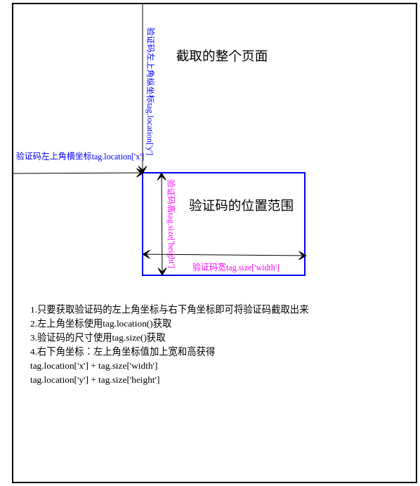

[toc]

# Selenium模块的基本使用

[Selenium官网](https://www.selenium.dev/documentation/zh-cn/) 

## 1. selenium模块与爬虫之间的关联
1. 便捷地获取网站中动态加载的数据 - 这些数据通过普通的requests无法获取
2. 便捷地实现模拟登录

## 2. selenium模块简介

是基于浏览器自动化的一个模块，通俗地说就是通过程序代码控制浏览器的操作。

## 3. selenium模块使用流程

### 3.1 环境的安装

- pip install --user selenium

### 3.2 下载一个浏览器的驱动程序

- chrome的驱动器[chromedriver](http://chromedriver.storage.googleapis.com/index.html) 
- 国内可以使用淘宝的镜像下载chromedriver[chromedriver taobao](http://npm.taobao.org/mirrors/chromedriver) 
- firefox的驱动器[firefoxdriver](https://github.com/mozilla/geckodriver/releases) 
- 下载自己浏览器当前版本对应的驱动器即可

	比如我现在Manjaro系统上的版本是：
	Chromium	84.0.4147.125 (正式版本) Arch Linux （64 位）
	那就下载这个版本对应的即可

Manjaro系统20.0.3版本上安装来chromium，即可直接使用，无需再次下载了。

以上都准备妥以后，就可以开始正式的使用selenium了。

### 3.3 实例化一个浏览器对象

```python
from selenium import webdriver

driver = webdriver.Chrome(
		executable_path="chromedriver",
		port=0,
		options=None,
		service_args=None,
		desired_capabilities=None,
		service_log_path=None,
		chrome_options=None,
		keep_alive=True
)
参数可以不写，或者仅需要指定webdriver的路径executable_path
```

### 3.4 编写基于浏览器自动化的操作代码

- 发起请求即打开一个网站 - driver.get(url)
- 获取当前url - driver.current_url
- 标签定位 - 使用driver.find_element系列的方法
- 标签交互 - tag.send_keys('string') - 给标签传入一个字符
- 点击按钮 - tag.click()
- 执行js程序 - driver.execute_script('js') - 比如这样的一段代码window.scrollTo(0,document.body.scrollHeight)用于向下滚动一屏
- 按下浏览器的前进按钮 - driver.forward() 
- 按下浏览器的后退按钮 - driver.back()
- 刷新当前页面 - driver.refresh()
- 获取当前页面的标题 - driver.title
- 关闭浏览器 - driver.quit()

**屏幕截图** 

```python
from selenium import webdriver

driver = webdriver.Chrome()

# Navigate to url
driver.get("http://www.example.com")

# Returns and base64 encoded string into image
driver.save_screenshot('./image.png')

driver.quit()
```

**元素截图** 

```python
from selenium import webdriver
from selenium.webdriver.common.by import By

driver = webdriver.Chrome()

# Navigate to url
driver.get("http://www.example.com")

ele = driver.find_element(By.CSS_SELECTOR, 'h1')

# Returns and base64 encoded string into image
ele.screenshot('./image.png')

driver.quit()
```


**浏览器导航**

| 说明               | 属性或方法         |
| ------             | ------             |
| 打开网站           | driver.get(url)    |
| 获取当前url        | driver.current_url |
| 按下浏览器后退按钮 | driver.back()      |
| 按下浏览器前进按钮 | driver.forward()   |
| 刷新当前页面       | driver.refresh()   |
| 获取当前页面的标题 | driver.title       |

**窗口和标签页** 

| 说明                         | 属性或方法                               |
| ---------------------------- | ---------------------------------------- |
| 获取当前窗口的窗口句柄       | driver.current_window_handle             |
| 打开并切换到新标签页         | driver.switch_to.new_window('tab')       |
| 打开一个新窗口并切换到新窗口 | driver.switch_to.new_window('window')    |
| 关闭标签页或窗口             | driver.close()                           |
| 切回到之前的标签页或窗口     | driver.switch_to.window(original_window) |
| 会话结束退出浏览器           | driver.quit()                            |
### 3.5 使用chromedriver的一个问题

chromedriver在打开浏览器后，当程序代码执行完毕，浏览器也跟着直接退出。

主要表现为如下几种情况：
1. 在vim中使用F5一键运行程序 - 执行完后就退出浏览器,无论是顺序流程还是函数中
2. 使用vim编辑完成代码，然后在终端命令行下使用python xxx.py来执行会出现2种情况
- chromedriver在顺序程序流程中时，浏览器不会退出
- 把chromedriver写在函数中时，浏览器会随着程序执行完成后就退出

解决办法 - 网上搜了一番，都没有完美的解决方案
- 不使用vim的一键运行，而是使用终端命令行来运行编辑好的程序
- 当chromedriver在函数中使用时，函数外部创建chromedriver实例，在函数内部使用global再次声明一次

## 4. 使用selenium对iframe处理，selenium的动作链

iframe - 嵌套在另一个页面中的页面，这个页面就是iframe

### 4.1 在iframe中的元素标签无法使用selenium的find_element方法获取到

```python
from selenium import webdriver

driver = webdriver.Chrome()
driver.get('https://www.runoob.com/try/try.php?filename=jqueryui-api-droppable')
div_tag = driver.find_element_by_id('draggable')
```

这个时候如果运行代码，就会出现找不到标签元素的错误提示

### 4.2 想要获取到iframe中的标签

需要先调用driver的switch_to.frame()方法切换到iframe中

```python
from selenium import webdriver

driver = webdriver.Chrome()
driver.get('https://www.runoob.com/try/try.php?filename=jqueryui-api-droppable')
driver.switch_to.frame('iframeResult')
div_tag = driver.find_element_by_id('draggable')
```

这样就可以定位到需要的标签了

原理：driver默认的作用域是在最外层的html页面中，当要定位到嵌套的子页面中的元素时，就要切换到相应的子页面中。

### 4.3 动作链

触发一系列的动作实现操作，形成动作链。比如拖动一个元素，就需要选中、按住、拖动、放下等动作，这些动作就形成一个动作链

1. 使用动作链，需要先导入动作链对应的ActionChains类

`from selenium.webdriver import ActionChains` 

2. 实例化ActionChains，以driver作为参数传入

`action = ActionChains(driver)` 

3. 点击并按住div_tag

`action.click_and_hold(div_tag)` 

4. 使用循环实现连续拖动div_tag

```python
for i in range(5):
    action.move_by_offset(17, 0).perform()
```
说明:
- move_by_offset(xoffset, yoffset)
		* xoffset - 水平方向移动，一个整数，正数向右，负数向左
		* yoffset - 垂着方向移动，一个整数，正数向下，负数向上
- perform() 立即执行动作链操作

5. 释放动作链

`action.release()` 

6. 完整的代码如下

```python
#!/usr/bin/env python3
# encoding: utf-8
# coding style: pep8
# ====================================================
#   Copyright (C)2020 All rights reserved.
#
#   Author        : cxysailor
#   Email         : cxysailor@163.com
#   File Name     : selenium_iframe.py
#   Last Modified : 2020-08-31 17:58
#   Describe      :
#
# ====================================================
import time
from selenium import webdriver
from selenium.webdriver import ActionChains

driver = webdriver.Chrome()
driver.get('https://www.runoob.com/try/try.php?filename=jqueryui-api-droppable')
# 切换到id为iframeResult的iframe
driver.switch_to.frame('iframeResult')
# 获取id为draggabel的div标签
div_tag = driver.find_element_by_id('draggable')

# 动作链
action = ActionChains(driver=driver)
# 点击并按住div_tag
action.click_and_hold(div_tag)
# 使用循环实现连续拖动div_tag
for i in range(5):
    # move_by_offset(xoffset, yoffset)移动标签，以像素为单位
    # perform()立即执行动作链操作
    action.move_by_offset(17, 0).perform()
    time.sleep(0.3)

# 使用完成，释放动作链
action.release()
driver.quit()

```

## 5. 使用selenium实现模拟登录QQ空间

分析网页

1. 打开QQ空间url: https://i.qq.com/,默认是通过扫描二维码登录，我们要模拟的是通过帐号密码登录
2. 所以需要点击一下"使用帐号密码登录"按钮切换。整个登录小窗口是放在一个iframe的子页面中的
3. 这样就需要先切换到iframe子页面中，才能获取相关的标签来操作

具体代码

```python
#!/usr/bin/env python3
# encoding: utf-8
# coding style: pep8
# ====================================================
#   Copyright (C)2020 All rights reserved.
#
#   Author        : cxysailor
#   Email         : cxysailor@163.com
#   File Name     : selenium_qzone.py
#   Last Modified : 2020-08-31 20:37
#   Describe      : 
#
# ====================================================
import time
from selenium import webdriver

browser = webdriver.Chrome(executable_path='/usr/local/bin/chromedriver')
# 请求QQ空间的页面
browser.get('https://i.qq.com/')
# 切换到id为login_frame的iframe中
browser.switch_to.frame('login_frame')
# 获取帐号密码登录按钮标签，其id为switcher_plogin
btn_plogin = browser.find_element_by_id('switcher_plogin')
# 点击btn_plogin按钮
btn_plogin.click()
time.sleep(1)
# 获取帐号输入框和密码输入框
user_input = browser.find_element_by_id('u')  # 帐号输入框
passwd_input = browser.find_element_by_id('p')  # 密码输入框
# 输入帐号与密码
user_input.send_keys('707778247')
time.sleep(1)
passwd_input.send_keys('74@PrIl27')
time.sleep(1)
# 获取并点击登录按钮
btn_login = browser.find_element_by_id('login_button')
btn_login.click()
time.sleep(10)

```

## 6. 无头浏览器 - 无可视化界面的浏览器

通常使用selenium时，会打开一个浏览器界面；但是中爬虫实际使用中，一般不需要这个浏览器界面，而且浏览器界面也会影响效率。

为实现不弹出浏览器界面，可以这样做

1. 导入无可视化界面的选项类Options

`from selenium.webdriver.chrome.options import Options` 

2. 添加无可视化的参数

```python
# 实例化Options
chrome_options = Options()
# 添加2个参数
chrome_options.add_argument('--headless')
chrome_options.add_argument('--disable-gpu')
```
3. 实例化webdriver时加入参数

`driver = webdriver.Chrome(executable_path='/usr/local/bin/chromedriver', options=chrome_options)` 

接下来的操作，就一样了...

代码举例

```python
#!/usr/bin/env python3
# encoding: utf-8
# coding style: pep8
# ====================================================
#   Copyright (C)2020 All rights reserved.
#
#   Author        : cxysailor
#   Email         : cxysailor@163.com
#   File Name     : selenium_headless.py
#   Last Modified : 2020-08-31 22:10
#   Describe      : 
#
# ====================================================
import time
from selenium import webdriver
from selenium.webdriver.chrome.options import Options

# 实例化Options
chrome_options = Options()
# 添加2个参数
chrome_options.add_argument('--headless')
chrome_options.add_argument('--disable-gpu')
# 实例化webdriver并加入参数
driver = webdriver.Chrome(executable_path='/usr/local/bin/chromedriver', options=chrome_options)
# 请求一个网址
driver.get('https://www.baidu.com')
# 打印结果验证是否执行了无头浏览器操作
print(driver.page_source)
time.sleep(2)
# 退出webdriver
driver.quit()
```
## 7. 实现规避检测

随着selenium的发展，有些网站也开始将selenium加入到反爬虫的检测中。

如何来规避这样的检测？

1. 导入

`from selenium.webdriver import ChromeOptions` 

2. 实例化

`options = ChromeOptions()` 

3. 添加参数

`options.add_experimental_option('excludeSwitches', ['enable-automation'])` 

4. 实例化webdriver并加入参数

```python
driver = webdriver.Chrome(
    executable_path='/usr/local/bin/chromedriver',
    options=options
)
```

但是，现在这些都被丢弃了，现在统一使用一个options参数即可

```python
#!/usr/bin/env python3
# encoding: utf-8
# coding style: pep8
# ====================================================
#   Copyright (C)2020 All rights reserved.
#
#   Author        : cxysailor
#   Email         : cxysailor@163.com
#   File Name     : selenium_anti_detect.py
#   Last Modified : 2020-08-31 22:41
#   Describe      : 
#
# ====================================================
import time
from selenium import webdriver
from selenium.webdriver.chrome.options import Options
# from selenium.webdriver import ChromeOptions


# 实例化Options
chrome_options = Options()
# 添加参数 - 实现无可视化界面
chrome_options.add_argument('--headless')
chrome_options.add_argument('--disable-gpu')
# 规避检测的参数直接加在这里就可以了
chrome_options.add_experimental_option('excludeSwitches', ['enable-automation'])

# 实例化ChromeOptions - 实现规避检测 - 现在不再使用
#  options = ChromeOptions()
# 添加参数
#  options.add_experimental_option('excludeSwitches', ['enable-automation'])

#  实例化webdriver，并传入参数
driver = webdriver.Chrome(
    executable_path='/usr/local/bin/chromedriver',
    options=chrome_options,  # 所有的参数都在这里
)
driver.get('https://www.baidu.com')

print(driver.page_source)
time.sleep(2)
driver.quit()

```
## 8. 超级鹰的使用及模拟登录

### 8.1 超级鹰的使用

1. 超级鹰的url：https://www.chaojiying.com/
2. 注册普通用户，也可以注册软件开发商
3. 登录注册好的普通用户
4. 题分查询 - 不足则需要充值
5. 创建一个软件 - 会生成软件ID和Key
6. 下载示例代码 - 在开发文档中选择对应的语言示例代码 - python
7. 使用下载的示例代码进行验证码的识别
8. 识别完成后，会返回对应图片的坐标 - 一个json格式的数据

```python
{
'err_no' : 0,
'err_str': 'OK',
'pic_id' : '9115519054743200003',
'pic_str': '133,77',  # 这个就是我们需要的坐标值
'md5'    : '11ae042184e1fde9d5f315d1023b91da'
} 
```

### 8.2 模拟登录12306网站

**页面分析**

1. 使用selenium打开12306的网页，默认是通过扫描二维码登录，需要点击帐号登录按钮切换到使用帐号密码登录
2. 切换到帐号密码登录页面后，将验证码图片截取下来
3. 这里不能使用再次请求验证码的链接来获取，因为再次对其发起请求，验证码就是一个新的了，不是与本次登录匹配的验证码，所以要截图
4. webdriver提供了整个页面的截图方法和对某个元素截图方法
- 整个页面截取 - 需要再次对图片进行裁剪得到验证码
		- driver.save_screenshot('./image.png')
- 对某个元素截取 - 直接获取的就是验证码
		- ele = driver.find_element(By.XPATH, '/html/body/div[2]/div[2]/ul/li[2]/a')  获取验证码图片元素
		- ele.screenshot('./image.png')  截取并保存为Base64编码格式的图片
5. 将获取的验证码图片使用超级鹰识别出来，返回识别对应图片的坐标值
6. 使用动作链实现对上述坐标值的点击

**截取整个页面，然后裁剪出验证码区域的操作**

 

1. 将整个页面截取下来并保存为hlg.png，需要找到验证码区域的左上角坐标与右下角坐标，就可以将验证码截取出来
2. 使用抓包分析工具 - 网页右键选检查 - 找到验证码的标签，并获取它
3. 获取它的坐标 - 即是该标签相对于整个页面的左上角的坐标

```python
ele = driver.find_element(By.XPATH, '/html/body/div[2]/div[2]/ul/li[2]/a')  # 获取验证码图片元素
ele.location  # 获取左上角的坐标值 - 返回一个字典{'x': integer, 'y': integer}
```
4. 获取它的尺寸 - 返回一个字典{'width': integer, 'height': integer}

```python
ele.size
```
5. 计算右下角的坐标

```python
ele.location['x'] + ele.size['width']  # 横坐标 - 左上角横坐标加上宽
ele.location['y'] + ele.size['height']  # 纵坐标 - 左上角纵坐标加上高
```
6. 将这2个坐标作为一个4元元祖 - 确定要截取的区域

```python
rangle = (
	ele.location['x'], 
	ele.location['y'],
	ele.location['x'] + ele.size['width'],
	ele.location['y'] + ele.size['height']
)
```
7. 使用PIL将其裁剪出来并保存

```python
from PIL import Image

img = Image.open('hlg.png')  # 实例化并打开整个页面的截图
# 使用Image的crop()截取指定的区域
code_img = img.crop(rangle)
# 将截取的图片保存
code_img.save('code.png')
```

8. 完整代码

```python
#!/usr/bin/env python3
# encoding: utf-8
# coding style: pep8
# ====================================================
#   Copyright (C)2020 All rights reserved.
#
#   Author        : cxysailor
#   Email         : cxysailor@163.com
#   File Name     : selenium_12306.py
#   Last Modified : 2020-09-01 16:23
#   Describe      : 
#
# ====================================================
import time
from selenium import webdriver
from selenium.webdriver.common.by import By
from PIL import Image

driver = webdriver.Chrome()
driver.maximize_window()  # 最大化窗口
driver.get('https://kyfw.12306.cn/otn/resources/login.html')
# 获取帐号登录按钮并点击，进入到帐号密码登录
login_by_user = driver.find_element(By.XPATH, '/html/body/div[2]/div[2]/ul/li[2]/a')
login_by_user.click()
time.sleep(1)
# 截取整个页面并保存
driver.save_screenshot('./images/hlg.png')
# 获取验证码区域的标签
code_tag = driver.find_element(By.ID, 'J-loginImg')
# 获取它的坐标及尺寸
x, y = code_tag.location['x'], code_tag.location['y']
w, h = code_tag.size['width'], code_tag.size['height']
#  print(x, y, w, h)
# 计算右下角的坐标
x1 = int(x) + int(w)
y1 = int(y) + int(h)
# 将2个坐标做一个元组，确定要截取的区域
rangle = (int(x), int(y), x1, y1)

# 实例化Image并打开截取下来的整个页面图片
img = Image.open('./images/hlg.png')
# 截取确定好的区域
code_img = img.crop(rangle)
# 保存截取的验证码
code_img.save('./images/code.png')

```
**基于上面的分析，登录12306网站的完整代码如下** 

截取整个页面，然后裁剪出验证码区域的代码

```python
#!/usr/bin/env python3
# encoding: utf-8
# coding style: pep8
# ====================================================
#   Copyright (C)2020 All rights reserved.
#
#   Author        : cxysailor
#   Email         : cxysailor@163.com
#   File Name     : selenium_12306.py
#   Last Modified : 2020-09-01 16:23
#   Describe      : 
#
# ====================================================
import time
from selenium import webdriver
from selenium.webdriver.common.by import By
from selenium.webdriver import ActionChains
from PIL import Image
from chaojiying_Python.chaojiying import Chaojiying_Client

if __name__ == "__main__":
    driver = webdriver.Chrome()
    driver.maximize_window()  # 最大化窗口
    driver.get('https://kyfw.12306.cn/otn/resources/login.html')
    # 获取帐号登录按钮并点击，进入到帐号密码登录
    login_by_user = driver.find_element(By.XPATH, '/html/body/div[2]/div[2]/ul/li[2]/a')
    login_by_user.click()
    time.sleep(1)
    # 截取整个页面并保存
    driver.save_screenshot('./images/hlg.png')
    # 获取验证码区域的标签
    code_tag = driver.find_element(By.ID, 'J-loginImg')
    # 获取它的坐标及尺寸
    x, y = code_tag.location['x'], code_tag.location['y']
    w, h = code_tag.size['width'], code_tag.size['height']
    #  print(x, y, w, h)
    # 计算右下角的坐标
    x1 = x + w
    y1 = y + h
    # 将2个坐标做一个元组，确定要截取的区域
    rangle = (x, y, x1, y1)

    # 实例化Image并打开截取下来的整个页面图片
    img = Image.open('./images/hlg.png')
    # 截取确定好的区域
    code_img = img.crop(rangle)
    # 保存截取的验证码
    code_img.save('./images/code.png')

    # 使用超级鹰识别验证码
    chaojiying = Chaojiying_Client('user', 'password', 'id')
    im = open('./images/code.png', 'rb').read()
    #  print(chaojiying.PostPic(im, 9004))
    result = chaojiying.PostPic(im, 9004)['pic_str']  # 获取返回的坐标值 - 是一个字符串
    #  print(result)
    #  print(type(result))

    # 对返回值进行处理
    if '|' in result:
        cos = list(result.split('|'))  # 将每组坐标放入一个列表cos
    else:
        cos = list(result.split(','))  # 没有|分隔，即只有一组坐标放入列表cos

    # 遍历列表cos并取出其中的每一组坐标，获取其中的横坐标与纵坐标(需要转换为int类型)
    # 接着使用动作链完成点击
    for co in enumerate(cos):
        x = int(co[1].split(',')[0])  # 横坐标
        y = int(co[1].split(',')[1])  # 纵坐标
        # 使用动作链的move_to_element_with_offset()方法完成点击
        # 坐标x,y是相对于验证码区域的值，所以传入上面获取的验证码code_tag
        ActionChains(driver).move_to_element_with_offset(code_tag, x, y).click().perform()
        time.sleep(1)

    # 获取用户名输入框及密码输入框
    u_input = driver.find_element(By.ID, 'J-userName')
    p_input = driver.find_element(By.ID, 'J-password')
    # 输入用户名及密码
    u_input.send_keys('xxx')
    p_input.send_keys('xxxxxx')

    # 获取登录按钮
    login_btn = driver.find_element(By.ID, 'J-login')
    # 点击登录按钮
    login_btn.click()

    time.sleep(10)
    driver.quit()

```
当然，还有一步滑动验证的功能没有做

直接截取验证码的代码

```python
#!/usr/bin/env python3
# encoding: utf-8
# coding style: pep8
# ====================================================
#   Copyright (C)2020 All rights reserved.
#
#   Author        : cxysailor
#   Email         : cxysailor@163.com
#   File Name     : selenium_12306.py
#   Last Modified : 2020-09-01 16:23
#   Describe      : 
#
# ====================================================
import time
from selenium import webdriver
from selenium.webdriver.common.by import By
from selenium.webdriver import ActionChains
from PIL import Image
from chaojiying_Python.chaojiying import Chaojiying_Client

if __name__ == "__main__":
    driver = webdriver.Chrome()
    driver.maximize_window()  # 最大化窗口
    driver.get('https://kyfw.12306.cn/otn/resources/login.html')
    # 获取帐号登录按钮并点击，进入到帐号密码登录
    login_by_user = driver.find_element(By.XPATH, '/html/body/div[2]/div[2]/ul/li[2]/a')
    login_by_user.click()
    time.sleep(1)
    # 获取验证码区域的标签
    code_tag = driver.find_element(By.ID, 'J-loginImg')
	# 截取验证码区域并保存
    code_img.save('./images/code.png')

    # 使用超级鹰识别验证码
    chaojiying = Chaojiying_Client('user', 'password', 'id')
    im = open('./images/code.png', 'rb').read()
    #  print(chaojiying.PostPic(im, 9004))
    result = chaojiying.PostPic(im, 9004)['pic_str']  # 获取返回的坐标值 - 是一个字符串
    #  print(result)
    #  print(type(result))

    # 对返回值进行处理
    if '|' in result:
        cos = list(result.split('|'))  # 将每组坐标放入一个列表cos
    else:
        cos = list(result.split(','))  # 没有|分隔，即只有一组坐标放入列表cos

    # 遍历列表cos并取出其中的每一组坐标，获取其中的横坐标与纵坐标(需要转换为int类型)
    # 接着使用动作链完成点击
    for co in enumerate(cos):
        x = int(co[1].split(',')[0])  # 横坐标
        y = int(co[1].split(',')[1])  # 纵坐标
        # 使用动作链的move_to_element_with_offset()方法完成点击
        # 坐标x,y是相对于验证码区域的值，所以传入上面获取的验证码code_tag
        ActionChains(driver).move_to_element_with_offset(code_tag, x, y).click().perform()
        time.sleep(1)

    # 获取用户名输入框及密码输入框
    u_input = driver.find_element(By.ID, 'J-userName')
    p_input = driver.find_element(By.ID, 'J-password')
    # 输入用户名及密码
    u_input.send_keys('xxx')
    p_input.send_keys('xxxxxx')

    # 获取登录按钮
    login_btn = driver.find_element(By.ID, 'J-login')
    # 点击登录按钮
    login_btn.click()

    time.sleep(10)
    driver.quit()

```
